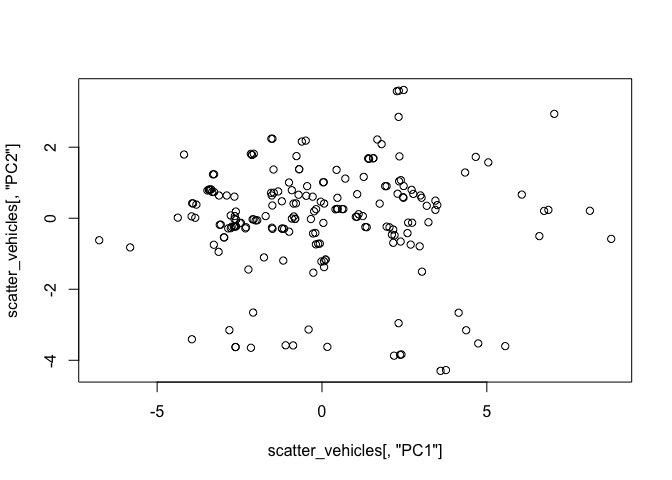
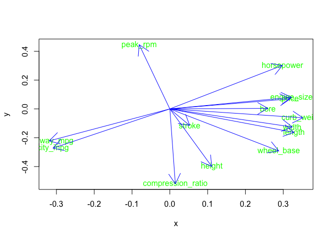

hw01-Soham-Ghosh
================

HW 01
-----

This is an R Markdown document. Markdown is a simple formatting syntax for authoring HTML, PDF, and MS Word documents. For more details on using R Markdown see <http://rmarkdown.rstudio.com>.

When you click the **Knit** button a document will be generated that includes both content as well as the output of any embedded R code chunks within the document. You can embed an R code chunk like this:

``` r
titles <- c("symboling", "normalized_losses", "make", "fuel_type", "aspiration", "num_of_doors", "body_style", "drive_wheels","engine_location","wheel_base","length","width","height","curb_weight","enginge_type", "num_of_cylinders","engine_size","fuel_system", "bore", "stroke","compression_ratio","horsepower","peak_rpm","city_mpg","highway_mpg","price")
types = c("double","double","character","character","character","character","character","character","character", "double","double","double","double","integer","character","character","integer","character","double","double","double","integer","integer","integer","integer","integer")
data <- read.csv(file = "imports-85.data", col.names = titles, colClasses = types, header = FALSE, na = "?")
data
```

    ##     symboling normalized_losses          make fuel_type aspiration
    ## 1           3                NA   alfa-romero       gas        std
    ## 2           3                NA   alfa-romero       gas        std
    ## 3           1                NA   alfa-romero       gas        std
    ## 4           2               164          audi       gas        std
    ## 5           2               164          audi       gas        std
    ## 6           2                NA          audi       gas        std
    ## 7           1               158          audi       gas        std
    ## 8           1                NA          audi       gas        std
    ## 9           1               158          audi       gas      turbo
    ## 10          0                NA          audi       gas      turbo
    ## 11          2               192           bmw       gas        std
    ## 12          0               192           bmw       gas        std
    ## 13          0               188           bmw       gas        std
    ## 14          0               188           bmw       gas        std
    ## 15          1                NA           bmw       gas        std
    ## 16          0                NA           bmw       gas        std
    ## 17          0                NA           bmw       gas        std
    ## 18          0                NA           bmw       gas        std
    ## 19          2               121     chevrolet       gas        std
    ## 20          1                98     chevrolet       gas        std
    ## 21          0                81     chevrolet       gas        std
    ## 22          1               118         dodge       gas        std
    ## 23          1               118         dodge       gas        std
    ## 24          1               118         dodge       gas      turbo
    ## 25          1               148         dodge       gas        std
    ## 26          1               148         dodge       gas        std
    ## 27          1               148         dodge       gas        std
    ## 28          1               148         dodge       gas      turbo
    ## 29         -1               110         dodge       gas        std
    ## 30          3               145         dodge       gas      turbo
    ## 31          2               137         honda       gas        std
    ## 32          2               137         honda       gas        std
    ## 33          1               101         honda       gas        std
    ## 34          1               101         honda       gas        std
    ## 35          1               101         honda       gas        std
    ## 36          0               110         honda       gas        std
    ## 37          0                78         honda       gas        std
    ## 38          0               106         honda       gas        std
    ## 39          0               106         honda       gas        std
    ## 40          0                85         honda       gas        std
    ## 41          0                85         honda       gas        std
    ## 42          0                85         honda       gas        std
    ## 43          1               107         honda       gas        std
    ## 44          0                NA         isuzu       gas        std
    ## 45          1                NA         isuzu       gas        std
    ## 46          0                NA         isuzu       gas        std
    ## 47          2                NA         isuzu       gas        std
    ## 48          0               145        jaguar       gas        std
    ## 49          0                NA        jaguar       gas        std
    ## 50          0                NA        jaguar       gas        std
    ## 51          1               104         mazda       gas        std
    ## 52          1               104         mazda       gas        std
    ## 53          1               104         mazda       gas        std
    ## 54          1               113         mazda       gas        std
    ## 55          1               113         mazda       gas        std
    ## 56          3               150         mazda       gas        std
    ## 57          3               150         mazda       gas        std
    ## 58          3               150         mazda       gas        std
    ## 59          3               150         mazda       gas        std
    ## 60          1               129         mazda       gas        std
    ## 61          0               115         mazda       gas        std
    ## 62          1               129         mazda       gas        std
    ## 63          0               115         mazda       gas        std
    ## 64          0                NA         mazda    diesel        std
    ## 65          0               115         mazda       gas        std
    ## 66          0               118         mazda       gas        std
    ## 67          0                NA         mazda    diesel        std
    ## 68         -1                93 mercedes-benz    diesel      turbo
    ## 69         -1                93 mercedes-benz    diesel      turbo
    ## 70          0                93 mercedes-benz    diesel      turbo
    ## 71         -1                93 mercedes-benz    diesel      turbo
    ## 72         -1                NA mercedes-benz       gas        std
    ## 73          3               142 mercedes-benz       gas        std
    ## 74          0                NA mercedes-benz       gas        std
    ## 75          1                NA mercedes-benz       gas        std
    ## 76          1                NA       mercury       gas      turbo
    ## 77          2               161    mitsubishi       gas        std
    ## 78          2               161    mitsubishi       gas        std
    ## 79          2               161    mitsubishi       gas        std
    ## 80          1               161    mitsubishi       gas      turbo
    ## 81          3               153    mitsubishi       gas      turbo
    ## 82          3               153    mitsubishi       gas        std
    ## 83          3                NA    mitsubishi       gas      turbo
    ## 84          3                NA    mitsubishi       gas      turbo
    ## 85          3                NA    mitsubishi       gas      turbo
    ## 86          1               125    mitsubishi       gas        std
    ## 87          1               125    mitsubishi       gas        std
    ## 88          1               125    mitsubishi       gas      turbo
    ## 89         -1               137    mitsubishi       gas        std
    ## 90          1               128        nissan       gas        std
    ## 91          1               128        nissan    diesel        std
    ## 92          1               128        nissan       gas        std
    ## 93          1               122        nissan       gas        std
    ## 94          1               103        nissan       gas        std
    ## 95          1               128        nissan       gas        std
    ## 96          1               128        nissan       gas        std
    ## 97          1               122        nissan       gas        std
    ## 98          1               103        nissan       gas        std
    ## 99          2               168        nissan       gas        std
    ## 100         0               106        nissan       gas        std
    ## 101         0               106        nissan       gas        std
    ## 102         0               128        nissan       gas        std
    ## 103         0               108        nissan       gas        std
    ## 104         0               108        nissan       gas        std
    ## 105         3               194        nissan       gas        std
    ## 106         3               194        nissan       gas      turbo
    ## 107         1               231        nissan       gas        std
    ## 108         0               161        peugot       gas        std
    ## 109         0               161        peugot    diesel      turbo
    ## 110         0                NA        peugot       gas        std
    ## 111         0                NA        peugot    diesel      turbo
    ## 112         0               161        peugot       gas        std
    ## 113         0               161        peugot    diesel      turbo
    ## 114         0                NA        peugot       gas        std
    ## 115         0                NA        peugot    diesel      turbo
    ## 116         0               161        peugot       gas        std
    ## 117         0               161        peugot    diesel      turbo
    ## 118         0               161        peugot       gas      turbo
    ## 119         1               119      plymouth       gas        std
    ## 120         1               119      plymouth       gas      turbo
    ## 121         1               154      plymouth       gas        std
    ## 122         1               154      plymouth       gas        std
    ## 123         1               154      plymouth       gas        std
    ## 124        -1                74      plymouth       gas        std
    ## 125         3                NA      plymouth       gas      turbo
    ## 126         3               186       porsche       gas        std
    ## 127         3                NA       porsche       gas        std
    ## 128         3                NA       porsche       gas        std
    ## 129         3                NA       porsche       gas        std
    ## 130         1                NA       porsche       gas        std
    ## 131         0                NA       renault       gas        std
    ## 132         2                NA       renault       gas        std
    ## 133         3               150          saab       gas        std
    ## 134         2               104          saab       gas        std
    ## 135         3               150          saab       gas        std
    ## 136         2               104          saab       gas        std
    ## 137         3               150          saab       gas      turbo
    ## 138         2               104          saab       gas      turbo
    ## 139         2                83        subaru       gas        std
    ## 140         2                83        subaru       gas        std
    ## 141         2                83        subaru       gas        std
    ## 142         0               102        subaru       gas        std
    ## 143         0               102        subaru       gas        std
    ## 144         0               102        subaru       gas        std
    ## 145         0               102        subaru       gas        std
    ## 146         0               102        subaru       gas      turbo
    ## 147         0                89        subaru       gas        std
    ## 148         0                89        subaru       gas        std
    ## 149         0                85        subaru       gas        std
    ## 150         0                85        subaru       gas      turbo
    ## 151         1                87        toyota       gas        std
    ## 152         1                87        toyota       gas        std
    ## 153         1                74        toyota       gas        std
    ## 154         0                77        toyota       gas        std
    ## 155         0                81        toyota       gas        std
    ## 156         0                91        toyota       gas        std
    ## 157         0                91        toyota       gas        std
    ## 158         0                91        toyota       gas        std
    ## 159         0                91        toyota    diesel        std
    ## 160         0                91        toyota    diesel        std
    ## 161         0                91        toyota       gas        std
    ## 162         0                91        toyota       gas        std
    ## 163         0                91        toyota       gas        std
    ## 164         1               168        toyota       gas        std
    ## 165         1               168        toyota       gas        std
    ## 166         1               168        toyota       gas        std
    ## 167         1               168        toyota       gas        std
    ## 168         2               134        toyota       gas        std
    ## 169         2               134        toyota       gas        std
    ## 170         2               134        toyota       gas        std
    ## 171         2               134        toyota       gas        std
    ## 172         2               134        toyota       gas        std
    ## 173         2               134        toyota       gas        std
    ## 174        -1                65        toyota       gas        std
    ## 175        -1                65        toyota    diesel      turbo
    ## 176        -1                65        toyota       gas        std
    ## 177        -1                65        toyota       gas        std
    ## 178        -1                65        toyota       gas        std
    ## 179         3               197        toyota       gas        std
    ## 180         3               197        toyota       gas        std
    ## 181        -1                90        toyota       gas        std
    ## 182        -1                NA        toyota       gas        std
    ## 183         2               122    volkswagen    diesel        std
    ## 184         2               122    volkswagen       gas        std
    ## 185         2                94    volkswagen    diesel        std
    ## 186         2                94    volkswagen       gas        std
    ## 187         2                94    volkswagen       gas        std
    ## 188         2                94    volkswagen    diesel      turbo
    ## 189         2                94    volkswagen       gas        std
    ## 190         3                NA    volkswagen       gas        std
    ## 191         3               256    volkswagen       gas        std
    ## 192         0                NA    volkswagen       gas        std
    ## 193         0                NA    volkswagen    diesel      turbo
    ## 194         0                NA    volkswagen       gas        std
    ## 195        -2               103         volvo       gas        std
    ## 196        -1                74         volvo       gas        std
    ## 197        -2               103         volvo       gas        std
    ## 198        -1                74         volvo       gas        std
    ## 199        -2               103         volvo       gas      turbo
    ## 200        -1                74         volvo       gas      turbo
    ## 201        -1                95         volvo       gas        std
    ## 202        -1                95         volvo       gas      turbo
    ## 203        -1                95         volvo       gas        std
    ## 204        -1                95         volvo    diesel      turbo
    ## 205        -1                95         volvo       gas      turbo
    ##     num_of_doors  body_style drive_wheels engine_location wheel_base
    ## 1            two convertible          rwd           front       88.6
    ## 2            two convertible          rwd           front       88.6
    ## 3            two   hatchback          rwd           front       94.5
    ## 4           four       sedan          fwd           front       99.8
    ## 5           four       sedan          4wd           front       99.4
    ## 6            two       sedan          fwd           front       99.8
    ## 7           four       sedan          fwd           front      105.8
    ## 8           four       wagon          fwd           front      105.8
    ## 9           four       sedan          fwd           front      105.8
    ## 10           two   hatchback          4wd           front       99.5
    ## 11           two       sedan          rwd           front      101.2
    ## 12          four       sedan          rwd           front      101.2
    ## 13           two       sedan          rwd           front      101.2
    ## 14          four       sedan          rwd           front      101.2
    ## 15          four       sedan          rwd           front      103.5
    ## 16          four       sedan          rwd           front      103.5
    ## 17           two       sedan          rwd           front      103.5
    ## 18          four       sedan          rwd           front      110.0
    ## 19           two   hatchback          fwd           front       88.4
    ## 20           two   hatchback          fwd           front       94.5
    ## 21          four       sedan          fwd           front       94.5
    ## 22           two   hatchback          fwd           front       93.7
    ## 23           two   hatchback          fwd           front       93.7
    ## 24           two   hatchback          fwd           front       93.7
    ## 25          four   hatchback          fwd           front       93.7
    ## 26          four       sedan          fwd           front       93.7
    ## 27          four       sedan          fwd           front       93.7
    ## 28          <NA>       sedan          fwd           front       93.7
    ## 29          four       wagon          fwd           front      103.3
    ## 30           two   hatchback          fwd           front       95.9
    ## 31           two   hatchback          fwd           front       86.6
    ## 32           two   hatchback          fwd           front       86.6
    ## 33           two   hatchback          fwd           front       93.7
    ## 34           two   hatchback          fwd           front       93.7
    ## 35           two   hatchback          fwd           front       93.7
    ## 36          four       sedan          fwd           front       96.5
    ## 37          four       wagon          fwd           front       96.5
    ## 38           two   hatchback          fwd           front       96.5
    ## 39           two   hatchback          fwd           front       96.5
    ## 40          four       sedan          fwd           front       96.5
    ## 41          four       sedan          fwd           front       96.5
    ## 42          four       sedan          fwd           front       96.5
    ## 43           two       sedan          fwd           front       96.5
    ## 44          four       sedan          rwd           front       94.3
    ## 45           two       sedan          fwd           front       94.5
    ## 46          four       sedan          fwd           front       94.5
    ## 47           two   hatchback          rwd           front       96.0
    ## 48          four       sedan          rwd           front      113.0
    ## 49          four       sedan          rwd           front      113.0
    ## 50           two       sedan          rwd           front      102.0
    ## 51           two   hatchback          fwd           front       93.1
    ## 52           two   hatchback          fwd           front       93.1
    ## 53           two   hatchback          fwd           front       93.1
    ## 54          four       sedan          fwd           front       93.1
    ## 55          four       sedan          fwd           front       93.1
    ## 56           two   hatchback          rwd           front       95.3
    ## 57           two   hatchback          rwd           front       95.3
    ## 58           two   hatchback          rwd           front       95.3
    ## 59           two   hatchback          rwd           front       95.3
    ## 60           two   hatchback          fwd           front       98.8
    ## 61          four       sedan          fwd           front       98.8
    ## 62           two   hatchback          fwd           front       98.8
    ## 63          four       sedan          fwd           front       98.8
    ## 64          <NA>       sedan          fwd           front       98.8
    ## 65          four   hatchback          fwd           front       98.8
    ## 66          four       sedan          rwd           front      104.9
    ## 67          four       sedan          rwd           front      104.9
    ## 68          four       sedan          rwd           front      110.0
    ## 69          four       wagon          rwd           front      110.0
    ## 70           two     hardtop          rwd           front      106.7
    ## 71          four       sedan          rwd           front      115.6
    ## 72          four       sedan          rwd           front      115.6
    ## 73           two convertible          rwd           front       96.6
    ## 74          four       sedan          rwd           front      120.9
    ## 75           two     hardtop          rwd           front      112.0
    ## 76           two   hatchback          rwd           front      102.7
    ## 77           two   hatchback          fwd           front       93.7
    ## 78           two   hatchback          fwd           front       93.7
    ## 79           two   hatchback          fwd           front       93.7
    ## 80           two   hatchback          fwd           front       93.0
    ## 81           two   hatchback          fwd           front       96.3
    ## 82           two   hatchback          fwd           front       96.3
    ## 83           two   hatchback          fwd           front       95.9
    ## 84           two   hatchback          fwd           front       95.9
    ## 85           two   hatchback          fwd           front       95.9
    ## 86          four       sedan          fwd           front       96.3
    ## 87          four       sedan          fwd           front       96.3
    ## 88          four       sedan          fwd           front       96.3
    ## 89          four       sedan          fwd           front       96.3
    ## 90           two       sedan          fwd           front       94.5
    ## 91           two       sedan          fwd           front       94.5
    ## 92           two       sedan          fwd           front       94.5
    ## 93          four       sedan          fwd           front       94.5
    ## 94          four       wagon          fwd           front       94.5
    ## 95           two       sedan          fwd           front       94.5
    ## 96           two   hatchback          fwd           front       94.5
    ## 97          four       sedan          fwd           front       94.5
    ## 98          four       wagon          fwd           front       94.5
    ## 99           two     hardtop          fwd           front       95.1
    ## 100         four   hatchback          fwd           front       97.2
    ## 101         four       sedan          fwd           front       97.2
    ## 102         four       sedan          fwd           front      100.4
    ## 103         four       wagon          fwd           front      100.4
    ## 104         four       sedan          fwd           front      100.4
    ## 105          two   hatchback          rwd           front       91.3
    ## 106          two   hatchback          rwd           front       91.3
    ## 107          two   hatchback          rwd           front       99.2
    ## 108         four       sedan          rwd           front      107.9
    ## 109         four       sedan          rwd           front      107.9
    ## 110         four       wagon          rwd           front      114.2
    ## 111         four       wagon          rwd           front      114.2
    ## 112         four       sedan          rwd           front      107.9
    ## 113         four       sedan          rwd           front      107.9
    ## 114         four       wagon          rwd           front      114.2
    ## 115         four       wagon          rwd           front      114.2
    ## 116         four       sedan          rwd           front      107.9
    ## 117         four       sedan          rwd           front      107.9
    ## 118         four       sedan          rwd           front      108.0
    ## 119          two   hatchback          fwd           front       93.7
    ## 120          two   hatchback          fwd           front       93.7
    ## 121         four   hatchback          fwd           front       93.7
    ## 122         four       sedan          fwd           front       93.7
    ## 123         four       sedan          fwd           front       93.7
    ## 124         four       wagon          fwd           front      103.3
    ## 125          two   hatchback          rwd           front       95.9
    ## 126          two   hatchback          rwd           front       94.5
    ## 127          two     hardtop          rwd            rear       89.5
    ## 128          two     hardtop          rwd            rear       89.5
    ## 129          two convertible          rwd            rear       89.5
    ## 130          two   hatchback          rwd           front       98.4
    ## 131         four       wagon          fwd           front       96.1
    ## 132          two   hatchback          fwd           front       96.1
    ## 133          two   hatchback          fwd           front       99.1
    ## 134         four       sedan          fwd           front       99.1
    ## 135          two   hatchback          fwd           front       99.1
    ## 136         four       sedan          fwd           front       99.1
    ## 137          two   hatchback          fwd           front       99.1
    ## 138         four       sedan          fwd           front       99.1
    ## 139          two   hatchback          fwd           front       93.7
    ## 140          two   hatchback          fwd           front       93.7
    ## 141          two   hatchback          4wd           front       93.3
    ## 142         four       sedan          fwd           front       97.2
    ## 143         four       sedan          fwd           front       97.2
    ## 144         four       sedan          fwd           front       97.2
    ## 145         four       sedan          4wd           front       97.0
    ## 146         four       sedan          4wd           front       97.0
    ## 147         four       wagon          fwd           front       97.0
    ## 148         four       wagon          fwd           front       97.0
    ## 149         four       wagon          4wd           front       96.9
    ## 150         four       wagon          4wd           front       96.9
    ## 151          two   hatchback          fwd           front       95.7
    ## 152          two   hatchback          fwd           front       95.7
    ## 153         four   hatchback          fwd           front       95.7
    ## 154         four       wagon          fwd           front       95.7
    ## 155         four       wagon          4wd           front       95.7
    ## 156         four       wagon          4wd           front       95.7
    ## 157         four       sedan          fwd           front       95.7
    ## 158         four   hatchback          fwd           front       95.7
    ## 159         four       sedan          fwd           front       95.7
    ## 160         four   hatchback          fwd           front       95.7
    ## 161         four       sedan          fwd           front       95.7
    ## 162         four   hatchback          fwd           front       95.7
    ## 163         four       sedan          fwd           front       95.7
    ## 164          two       sedan          rwd           front       94.5
    ## 165          two   hatchback          rwd           front       94.5
    ## 166          two       sedan          rwd           front       94.5
    ## 167          two   hatchback          rwd           front       94.5
    ## 168          two     hardtop          rwd           front       98.4
    ## 169          two     hardtop          rwd           front       98.4
    ## 170          two   hatchback          rwd           front       98.4
    ## 171          two     hardtop          rwd           front       98.4
    ## 172          two   hatchback          rwd           front       98.4
    ## 173          two convertible          rwd           front       98.4
    ## 174         four       sedan          fwd           front      102.4
    ## 175         four       sedan          fwd           front      102.4
    ## 176         four   hatchback          fwd           front      102.4
    ## 177         four       sedan          fwd           front      102.4
    ## 178         four   hatchback          fwd           front      102.4
    ## 179          two   hatchback          rwd           front      102.9
    ## 180          two   hatchback          rwd           front      102.9
    ## 181         four       sedan          rwd           front      104.5
    ## 182         four       wagon          rwd           front      104.5
    ## 183          two       sedan          fwd           front       97.3
    ## 184          two       sedan          fwd           front       97.3
    ## 185         four       sedan          fwd           front       97.3
    ## 186         four       sedan          fwd           front       97.3
    ## 187         four       sedan          fwd           front       97.3
    ## 188         four       sedan          fwd           front       97.3
    ## 189         four       sedan          fwd           front       97.3
    ## 190          two convertible          fwd           front       94.5
    ## 191          two   hatchback          fwd           front       94.5
    ## 192         four       sedan          fwd           front      100.4
    ## 193         four       sedan          fwd           front      100.4
    ## 194         four       wagon          fwd           front      100.4
    ## 195         four       sedan          rwd           front      104.3
    ## 196         four       wagon          rwd           front      104.3
    ## 197         four       sedan          rwd           front      104.3
    ## 198         four       wagon          rwd           front      104.3
    ## 199         four       sedan          rwd           front      104.3
    ## 200         four       wagon          rwd           front      104.3
    ## 201         four       sedan          rwd           front      109.1
    ## 202         four       sedan          rwd           front      109.1
    ## 203         four       sedan          rwd           front      109.1
    ## 204         four       sedan          rwd           front      109.1
    ## 205         four       sedan          rwd           front      109.1
    ##     length width height curb_weight enginge_type num_of_cylinders
    ## 1    168.8  64.1   48.8        2548         dohc             four
    ## 2    168.8  64.1   48.8        2548         dohc             four
    ## 3    171.2  65.5   52.4        2823         ohcv              six
    ## 4    176.6  66.2   54.3        2337          ohc             four
    ## 5    176.6  66.4   54.3        2824          ohc             five
    ## 6    177.3  66.3   53.1        2507          ohc             five
    ## 7    192.7  71.4   55.7        2844          ohc             five
    ## 8    192.7  71.4   55.7        2954          ohc             five
    ## 9    192.7  71.4   55.9        3086          ohc             five
    ## 10   178.2  67.9   52.0        3053          ohc             five
    ## 11   176.8  64.8   54.3        2395          ohc             four
    ## 12   176.8  64.8   54.3        2395          ohc             four
    ## 13   176.8  64.8   54.3        2710          ohc              six
    ## 14   176.8  64.8   54.3        2765          ohc              six
    ## 15   189.0  66.9   55.7        3055          ohc              six
    ## 16   189.0  66.9   55.7        3230          ohc              six
    ## 17   193.8  67.9   53.7        3380          ohc              six
    ## 18   197.0  70.9   56.3        3505          ohc              six
    ## 19   141.1  60.3   53.2        1488            l            three
    ## 20   155.9  63.6   52.0        1874          ohc             four
    ## 21   158.8  63.6   52.0        1909          ohc             four
    ## 22   157.3  63.8   50.8        1876          ohc             four
    ## 23   157.3  63.8   50.8        1876          ohc             four
    ## 24   157.3  63.8   50.8        2128          ohc             four
    ## 25   157.3  63.8   50.6        1967          ohc             four
    ## 26   157.3  63.8   50.6        1989          ohc             four
    ## 27   157.3  63.8   50.6        1989          ohc             four
    ## 28   157.3  63.8   50.6        2191          ohc             four
    ## 29   174.6  64.6   59.8        2535          ohc             four
    ## 30   173.2  66.3   50.2        2811          ohc             four
    ## 31   144.6  63.9   50.8        1713          ohc             four
    ## 32   144.6  63.9   50.8        1819          ohc             four
    ## 33   150.0  64.0   52.6        1837          ohc             four
    ## 34   150.0  64.0   52.6        1940          ohc             four
    ## 35   150.0  64.0   52.6        1956          ohc             four
    ## 36   163.4  64.0   54.5        2010          ohc             four
    ## 37   157.1  63.9   58.3        2024          ohc             four
    ## 38   167.5  65.2   53.3        2236          ohc             four
    ## 39   167.5  65.2   53.3        2289          ohc             four
    ## 40   175.4  65.2   54.1        2304          ohc             four
    ## 41   175.4  62.5   54.1        2372          ohc             four
    ## 42   175.4  65.2   54.1        2465          ohc             four
    ## 43   169.1  66.0   51.0        2293          ohc             four
    ## 44   170.7  61.8   53.5        2337          ohc             four
    ## 45   155.9  63.6   52.0        1874          ohc             four
    ## 46   155.9  63.6   52.0        1909          ohc             four
    ## 47   172.6  65.2   51.4        2734          ohc             four
    ## 48   199.6  69.6   52.8        4066         dohc              six
    ## 49   199.6  69.6   52.8        4066         dohc              six
    ## 50   191.7  70.6   47.8        3950         ohcv           twelve
    ## 51   159.1  64.2   54.1        1890          ohc             four
    ## 52   159.1  64.2   54.1        1900          ohc             four
    ## 53   159.1  64.2   54.1        1905          ohc             four
    ## 54   166.8  64.2   54.1        1945          ohc             four
    ## 55   166.8  64.2   54.1        1950          ohc             four
    ## 56   169.0  65.7   49.6        2380        rotor              two
    ## 57   169.0  65.7   49.6        2380        rotor              two
    ## 58   169.0  65.7   49.6        2385        rotor              two
    ## 59   169.0  65.7   49.6        2500        rotor              two
    ## 60   177.8  66.5   53.7        2385          ohc             four
    ## 61   177.8  66.5   55.5        2410          ohc             four
    ## 62   177.8  66.5   53.7        2385          ohc             four
    ## 63   177.8  66.5   55.5        2410          ohc             four
    ## 64   177.8  66.5   55.5        2443          ohc             four
    ## 65   177.8  66.5   55.5        2425          ohc             four
    ## 66   175.0  66.1   54.4        2670          ohc             four
    ## 67   175.0  66.1   54.4        2700          ohc             four
    ## 68   190.9  70.3   56.5        3515          ohc             five
    ## 69   190.9  70.3   58.7        3750          ohc             five
    ## 70   187.5  70.3   54.9        3495          ohc             five
    ## 71   202.6  71.7   56.3        3770          ohc             five
    ## 72   202.6  71.7   56.5        3740         ohcv            eight
    ## 73   180.3  70.5   50.8        3685         ohcv            eight
    ## 74   208.1  71.7   56.7        3900         ohcv            eight
    ## 75   199.2  72.0   55.4        3715         ohcv            eight
    ## 76   178.4  68.0   54.8        2910          ohc             four
    ## 77   157.3  64.4   50.8        1918          ohc             four
    ## 78   157.3  64.4   50.8        1944          ohc             four
    ## 79   157.3  64.4   50.8        2004          ohc             four
    ## 80   157.3  63.8   50.8        2145          ohc             four
    ## 81   173.0  65.4   49.4        2370          ohc             four
    ## 82   173.0  65.4   49.4        2328          ohc             four
    ## 83   173.2  66.3   50.2        2833          ohc             four
    ## 84   173.2  66.3   50.2        2921          ohc             four
    ## 85   173.2  66.3   50.2        2926          ohc             four
    ## 86   172.4  65.4   51.6        2365          ohc             four
    ## 87   172.4  65.4   51.6        2405          ohc             four
    ## 88   172.4  65.4   51.6        2403          ohc             four
    ## 89   172.4  65.4   51.6        2403          ohc             four
    ## 90   165.3  63.8   54.5        1889          ohc             four
    ## 91   165.3  63.8   54.5        2017          ohc             four
    ## 92   165.3  63.8   54.5        1918          ohc             four
    ## 93   165.3  63.8   54.5        1938          ohc             four
    ## 94   170.2  63.8   53.5        2024          ohc             four
    ## 95   165.3  63.8   54.5        1951          ohc             four
    ## 96   165.6  63.8   53.3        2028          ohc             four
    ## 97   165.3  63.8   54.5        1971          ohc             four
    ## 98   170.2  63.8   53.5        2037          ohc             four
    ## 99   162.4  63.8   53.3        2008          ohc             four
    ## 100  173.4  65.2   54.7        2324          ohc             four
    ## 101  173.4  65.2   54.7        2302          ohc             four
    ## 102  181.7  66.5   55.1        3095         ohcv              six
    ## 103  184.6  66.5   56.1        3296         ohcv              six
    ## 104  184.6  66.5   55.1        3060         ohcv              six
    ## 105  170.7  67.9   49.7        3071         ohcv              six
    ## 106  170.7  67.9   49.7        3139         ohcv              six
    ## 107  178.5  67.9   49.7        3139         ohcv              six
    ## 108  186.7  68.4   56.7        3020            l             four
    ## 109  186.7  68.4   56.7        3197            l             four
    ## 110  198.9  68.4   58.7        3230            l             four
    ## 111  198.9  68.4   58.7        3430            l             four
    ## 112  186.7  68.4   56.7        3075            l             four
    ## 113  186.7  68.4   56.7        3252            l             four
    ## 114  198.9  68.4   56.7        3285            l             four
    ## 115  198.9  68.4   58.7        3485            l             four
    ## 116  186.7  68.4   56.7        3075            l             four
    ## 117  186.7  68.4   56.7        3252            l             four
    ## 118  186.7  68.3   56.0        3130            l             four
    ## 119  157.3  63.8   50.8        1918          ohc             four
    ## 120  157.3  63.8   50.8        2128          ohc             four
    ## 121  157.3  63.8   50.6        1967          ohc             four
    ## 122  167.3  63.8   50.8        1989          ohc             four
    ## 123  167.3  63.8   50.8        2191          ohc             four
    ## 124  174.6  64.6   59.8        2535          ohc             four
    ## 125  173.2  66.3   50.2        2818          ohc             four
    ## 126  168.9  68.3   50.2        2778          ohc             four
    ## 127  168.9  65.0   51.6        2756         ohcf              six
    ## 128  168.9  65.0   51.6        2756         ohcf              six
    ## 129  168.9  65.0   51.6        2800         ohcf              six
    ## 130  175.7  72.3   50.5        3366        dohcv            eight
    ## 131  181.5  66.5   55.2        2579          ohc             four
    ## 132  176.8  66.6   50.5        2460          ohc             four
    ## 133  186.6  66.5   56.1        2658          ohc             four
    ## 134  186.6  66.5   56.1        2695          ohc             four
    ## 135  186.6  66.5   56.1        2707          ohc             four
    ## 136  186.6  66.5   56.1        2758          ohc             four
    ## 137  186.6  66.5   56.1        2808         dohc             four
    ## 138  186.6  66.5   56.1        2847         dohc             four
    ## 139  156.9  63.4   53.7        2050         ohcf             four
    ## 140  157.9  63.6   53.7        2120         ohcf             four
    ## 141  157.3  63.8   55.7        2240         ohcf             four
    ## 142  172.0  65.4   52.5        2145         ohcf             four
    ## 143  172.0  65.4   52.5        2190         ohcf             four
    ## 144  172.0  65.4   52.5        2340         ohcf             four
    ## 145  172.0  65.4   54.3        2385         ohcf             four
    ## 146  172.0  65.4   54.3        2510         ohcf             four
    ## 147  173.5  65.4   53.0        2290         ohcf             four
    ## 148  173.5  65.4   53.0        2455         ohcf             four
    ## 149  173.6  65.4   54.9        2420         ohcf             four
    ## 150  173.6  65.4   54.9        2650         ohcf             four
    ## 151  158.7  63.6   54.5        1985          ohc             four
    ## 152  158.7  63.6   54.5        2040          ohc             four
    ## 153  158.7  63.6   54.5        2015          ohc             four
    ## 154  169.7  63.6   59.1        2280          ohc             four
    ## 155  169.7  63.6   59.1        2290          ohc             four
    ## 156  169.7  63.6   59.1        3110          ohc             four
    ## 157  166.3  64.4   53.0        2081          ohc             four
    ## 158  166.3  64.4   52.8        2109          ohc             four
    ## 159  166.3  64.4   53.0        2275          ohc             four
    ## 160  166.3  64.4   52.8        2275          ohc             four
    ## 161  166.3  64.4   53.0        2094          ohc             four
    ## 162  166.3  64.4   52.8        2122          ohc             four
    ## 163  166.3  64.4   52.8        2140          ohc             four
    ## 164  168.7  64.0   52.6        2169          ohc             four
    ## 165  168.7  64.0   52.6        2204          ohc             four
    ## 166  168.7  64.0   52.6        2265         dohc             four
    ## 167  168.7  64.0   52.6        2300         dohc             four
    ## 168  176.2  65.6   52.0        2540          ohc             four
    ## 169  176.2  65.6   52.0        2536          ohc             four
    ## 170  176.2  65.6   52.0        2551          ohc             four
    ## 171  176.2  65.6   52.0        2679          ohc             four
    ## 172  176.2  65.6   52.0        2714          ohc             four
    ## 173  176.2  65.6   53.0        2975          ohc             four
    ## 174  175.6  66.5   54.9        2326          ohc             four
    ## 175  175.6  66.5   54.9        2480          ohc             four
    ## 176  175.6  66.5   53.9        2414          ohc             four
    ## 177  175.6  66.5   54.9        2414          ohc             four
    ## 178  175.6  66.5   53.9        2458          ohc             four
    ## 179  183.5  67.7   52.0        2976         dohc              six
    ## 180  183.5  67.7   52.0        3016         dohc              six
    ## 181  187.8  66.5   54.1        3131         dohc              six
    ## 182  187.8  66.5   54.1        3151         dohc              six
    ## 183  171.7  65.5   55.7        2261          ohc             four
    ## 184  171.7  65.5   55.7        2209          ohc             four
    ## 185  171.7  65.5   55.7        2264          ohc             four
    ## 186  171.7  65.5   55.7        2212          ohc             four
    ## 187  171.7  65.5   55.7        2275          ohc             four
    ## 188  171.7  65.5   55.7        2319          ohc             four
    ## 189  171.7  65.5   55.7        2300          ohc             four
    ## 190  159.3  64.2   55.6        2254          ohc             four
    ## 191  165.7  64.0   51.4        2221          ohc             four
    ## 192  180.2  66.9   55.1        2661          ohc             five
    ## 193  180.2  66.9   55.1        2579          ohc             four
    ## 194  183.1  66.9   55.1        2563          ohc             four
    ## 195  188.8  67.2   56.2        2912          ohc             four
    ## 196  188.8  67.2   57.5        3034          ohc             four
    ## 197  188.8  67.2   56.2        2935          ohc             four
    ## 198  188.8  67.2   57.5        3042          ohc             four
    ## 199  188.8  67.2   56.2        3045          ohc             four
    ## 200  188.8  67.2   57.5        3157          ohc             four
    ## 201  188.8  68.9   55.5        2952          ohc             four
    ## 202  188.8  68.8   55.5        3049          ohc             four
    ## 203  188.8  68.9   55.5        3012         ohcv              six
    ## 204  188.8  68.9   55.5        3217          ohc              six
    ## 205  188.8  68.9   55.5        3062          ohc             four
    ##     engine_size fuel_system bore stroke compression_ratio horsepower
    ## 1           130        mpfi 3.47   2.68              9.00        111
    ## 2           130        mpfi 3.47   2.68              9.00        111
    ## 3           152        mpfi 2.68   3.47              9.00        154
    ## 4           109        mpfi 3.19   3.40             10.00        102
    ## 5           136        mpfi 3.19   3.40              8.00        115
    ## 6           136        mpfi 3.19   3.40              8.50        110
    ## 7           136        mpfi 3.19   3.40              8.50        110
    ## 8           136        mpfi 3.19   3.40              8.50        110
    ## 9           131        mpfi 3.13   3.40              8.30        140
    ## 10          131        mpfi 3.13   3.40              7.00        160
    ## 11          108        mpfi 3.50   2.80              8.80        101
    ## 12          108        mpfi 3.50   2.80              8.80        101
    ## 13          164        mpfi 3.31   3.19              9.00        121
    ## 14          164        mpfi 3.31   3.19              9.00        121
    ## 15          164        mpfi 3.31   3.19              9.00        121
    ## 16          209        mpfi 3.62   3.39              8.00        182
    ## 17          209        mpfi 3.62   3.39              8.00        182
    ## 18          209        mpfi 3.62   3.39              8.00        182
    ## 19           61        2bbl 2.91   3.03              9.50         48
    ## 20           90        2bbl 3.03   3.11              9.60         70
    ## 21           90        2bbl 3.03   3.11              9.60         70
    ## 22           90        2bbl 2.97   3.23              9.41         68
    ## 23           90        2bbl 2.97   3.23              9.40         68
    ## 24           98        mpfi 3.03   3.39              7.60        102
    ## 25           90        2bbl 2.97   3.23              9.40         68
    ## 26           90        2bbl 2.97   3.23              9.40         68
    ## 27           90        2bbl 2.97   3.23              9.40         68
    ## 28           98        mpfi 3.03   3.39              7.60        102
    ## 29          122        2bbl 3.34   3.46              8.50         88
    ## 30          156         mfi 3.60   3.90              7.00        145
    ## 31           92        1bbl 2.91   3.41              9.60         58
    ## 32           92        1bbl 2.91   3.41              9.20         76
    ## 33           79        1bbl 2.91   3.07             10.10         60
    ## 34           92        1bbl 2.91   3.41              9.20         76
    ## 35           92        1bbl 2.91   3.41              9.20         76
    ## 36           92        1bbl 2.91   3.41              9.20         76
    ## 37           92        1bbl 2.92   3.41              9.20         76
    ## 38          110        1bbl 3.15   3.58              9.00         86
    ## 39          110        1bbl 3.15   3.58              9.00         86
    ## 40          110        1bbl 3.15   3.58              9.00         86
    ## 41          110        1bbl 3.15   3.58              9.00         86
    ## 42          110        mpfi 3.15   3.58              9.00        101
    ## 43          110        2bbl 3.15   3.58              9.10        100
    ## 44          111        2bbl 3.31   3.23              8.50         78
    ## 45           90        2bbl 3.03   3.11              9.60         70
    ## 46           90        2bbl 3.03   3.11              9.60         70
    ## 47          119        spfi 3.43   3.23              9.20         90
    ## 48          258        mpfi 3.63   4.17              8.10        176
    ## 49          258        mpfi 3.63   4.17              8.10        176
    ## 50          326        mpfi 3.54   2.76             11.50        262
    ## 51           91        2bbl 3.03   3.15              9.00         68
    ## 52           91        2bbl 3.03   3.15              9.00         68
    ## 53           91        2bbl 3.03   3.15              9.00         68
    ## 54           91        2bbl 3.03   3.15              9.00         68
    ## 55           91        2bbl 3.08   3.15              9.00         68
    ## 56           70        4bbl   NA     NA              9.40        101
    ## 57           70        4bbl   NA     NA              9.40        101
    ## 58           70        4bbl   NA     NA              9.40        101
    ## 59           80        mpfi   NA     NA              9.40        135
    ## 60          122        2bbl 3.39   3.39              8.60         84
    ## 61          122        2bbl 3.39   3.39              8.60         84
    ## 62          122        2bbl 3.39   3.39              8.60         84
    ## 63          122        2bbl 3.39   3.39              8.60         84
    ## 64          122         idi 3.39   3.39             22.70         64
    ## 65          122        2bbl 3.39   3.39              8.60         84
    ## 66          140        mpfi 3.76   3.16              8.00        120
    ## 67          134         idi 3.43   3.64             22.00         72
    ## 68          183         idi 3.58   3.64             21.50        123
    ## 69          183         idi 3.58   3.64             21.50        123
    ## 70          183         idi 3.58   3.64             21.50        123
    ## 71          183         idi 3.58   3.64             21.50        123
    ## 72          234        mpfi 3.46   3.10              8.30        155
    ## 73          234        mpfi 3.46   3.10              8.30        155
    ## 74          308        mpfi 3.80   3.35              8.00        184
    ## 75          304        mpfi 3.80   3.35              8.00        184
    ## 76          140        mpfi 3.78   3.12              8.00        175
    ## 77           92        2bbl 2.97   3.23              9.40         68
    ## 78           92        2bbl 2.97   3.23              9.40         68
    ## 79           92        2bbl 2.97   3.23              9.40         68
    ## 80           98        spdi 3.03   3.39              7.60        102
    ## 81          110        spdi 3.17   3.46              7.50        116
    ## 82          122        2bbl 3.35   3.46              8.50         88
    ## 83          156        spdi 3.58   3.86              7.00        145
    ## 84          156        spdi 3.59   3.86              7.00        145
    ## 85          156        spdi 3.59   3.86              7.00        145
    ## 86          122        2bbl 3.35   3.46              8.50         88
    ## 87          122        2bbl 3.35   3.46              8.50         88
    ## 88          110        spdi 3.17   3.46              7.50        116
    ## 89          110        spdi 3.17   3.46              7.50        116
    ## 90           97        2bbl 3.15   3.29              9.40         69
    ## 91          103         idi 2.99   3.47             21.90         55
    ## 92           97        2bbl 3.15   3.29              9.40         69
    ## 93           97        2bbl 3.15   3.29              9.40         69
    ## 94           97        2bbl 3.15   3.29              9.40         69
    ## 95           97        2bbl 3.15   3.29              9.40         69
    ## 96           97        2bbl 3.15   3.29              9.40         69
    ## 97           97        2bbl 3.15   3.29              9.40         69
    ## 98           97        2bbl 3.15   3.29              9.40         69
    ## 99           97        2bbl 3.15   3.29              9.40         69
    ## 100         120        2bbl 3.33   3.47              8.50         97
    ## 101         120        2bbl 3.33   3.47              8.50         97
    ## 102         181        mpfi 3.43   3.27              9.00        152
    ## 103         181        mpfi 3.43   3.27              9.00        152
    ## 104         181        mpfi 3.43   3.27              9.00        152
    ## 105         181        mpfi 3.43   3.27              9.00        160
    ## 106         181        mpfi 3.43   3.27              7.80        200
    ## 107         181        mpfi 3.43   3.27              9.00        160
    ## 108         120        mpfi 3.46   3.19              8.40         97
    ## 109         152         idi 3.70   3.52             21.00         95
    ## 110         120        mpfi 3.46   3.19              8.40         97
    ## 111         152         idi 3.70   3.52             21.00         95
    ## 112         120        mpfi 3.46   2.19              8.40         95
    ## 113         152         idi 3.70   3.52             21.00         95
    ## 114         120        mpfi 3.46   2.19              8.40         95
    ## 115         152         idi 3.70   3.52             21.00         95
    ## 116         120        mpfi 3.46   3.19              8.40         97
    ## 117         152         idi 3.70   3.52             21.00         95
    ## 118         134        mpfi 3.61   3.21              7.00        142
    ## 119          90        2bbl 2.97   3.23              9.40         68
    ## 120          98        spdi 3.03   3.39              7.60        102
    ## 121          90        2bbl 2.97   3.23              9.40         68
    ## 122          90        2bbl 2.97   3.23              9.40         68
    ## 123          98        2bbl 2.97   3.23              9.40         68
    ## 124         122        2bbl 3.35   3.46              8.50         88
    ## 125         156        spdi 3.59   3.86              7.00        145
    ## 126         151        mpfi 3.94   3.11              9.50        143
    ## 127         194        mpfi 3.74   2.90              9.50        207
    ## 128         194        mpfi 3.74   2.90              9.50        207
    ## 129         194        mpfi 3.74   2.90              9.50        207
    ## 130         203        mpfi 3.94   3.11             10.00        288
    ## 131         132        mpfi 3.46   3.90              8.70         NA
    ## 132         132        mpfi 3.46   3.90              8.70         NA
    ## 133         121        mpfi 3.54   3.07              9.31        110
    ## 134         121        mpfi 3.54   3.07              9.30        110
    ## 135         121        mpfi 2.54   2.07              9.30        110
    ## 136         121        mpfi 3.54   3.07              9.30        110
    ## 137         121        mpfi 3.54   3.07              9.00        160
    ## 138         121        mpfi 3.54   3.07              9.00        160
    ## 139          97        2bbl 3.62   2.36              9.00         69
    ## 140         108        2bbl 3.62   2.64              8.70         73
    ## 141         108        2bbl 3.62   2.64              8.70         73
    ## 142         108        2bbl 3.62   2.64              9.50         82
    ## 143         108        2bbl 3.62   2.64              9.50         82
    ## 144         108        mpfi 3.62   2.64              9.00         94
    ## 145         108        2bbl 3.62   2.64              9.00         82
    ## 146         108        mpfi 3.62   2.64              7.70        111
    ## 147         108        2bbl 3.62   2.64              9.00         82
    ## 148         108        mpfi 3.62   2.64              9.00         94
    ## 149         108        2bbl 3.62   2.64              9.00         82
    ## 150         108        mpfi 3.62   2.64              7.70        111
    ## 151          92        2bbl 3.05   3.03              9.00         62
    ## 152          92        2bbl 3.05   3.03              9.00         62
    ## 153          92        2bbl 3.05   3.03              9.00         62
    ## 154          92        2bbl 3.05   3.03              9.00         62
    ## 155          92        2bbl 3.05   3.03              9.00         62
    ## 156          92        2bbl 3.05   3.03              9.00         62
    ## 157          98        2bbl 3.19   3.03              9.00         70
    ## 158          98        2bbl 3.19   3.03              9.00         70
    ## 159         110         idi 3.27   3.35             22.50         56
    ## 160         110         idi 3.27   3.35             22.50         56
    ## 161          98        2bbl 3.19   3.03              9.00         70
    ## 162          98        2bbl 3.19   3.03              9.00         70
    ## 163          98        2bbl 3.19   3.03              9.00         70
    ## 164          98        2bbl 3.19   3.03              9.00         70
    ## 165          98        2bbl 3.19   3.03              9.00         70
    ## 166          98        mpfi 3.24   3.08              9.40        112
    ## 167          98        mpfi 3.24   3.08              9.40        112
    ## 168         146        mpfi 3.62   3.50              9.30        116
    ## 169         146        mpfi 3.62   3.50              9.30        116
    ## 170         146        mpfi 3.62   3.50              9.30        116
    ## 171         146        mpfi 3.62   3.50              9.30        116
    ## 172         146        mpfi 3.62   3.50              9.30        116
    ## 173         146        mpfi 3.62   3.50              9.30        116
    ## 174         122        mpfi 3.31   3.54              8.70         92
    ## 175         110         idi 3.27   3.35             22.50         73
    ## 176         122        mpfi 3.31   3.54              8.70         92
    ## 177         122        mpfi 3.31   3.54              8.70         92
    ## 178         122        mpfi 3.31   3.54              8.70         92
    ## 179         171        mpfi 3.27   3.35              9.30        161
    ## 180         171        mpfi 3.27   3.35              9.30        161
    ## 181         171        mpfi 3.27   3.35              9.20        156
    ## 182         161        mpfi 3.27   3.35              9.20        156
    ## 183          97         idi 3.01   3.40             23.00         52
    ## 184         109        mpfi 3.19   3.40              9.00         85
    ## 185          97         idi 3.01   3.40             23.00         52
    ## 186         109        mpfi 3.19   3.40              9.00         85
    ## 187         109        mpfi 3.19   3.40              9.00         85
    ## 188          97         idi 3.01   3.40             23.00         68
    ## 189         109        mpfi 3.19   3.40             10.00        100
    ## 190         109        mpfi 3.19   3.40              8.50         90
    ## 191         109        mpfi 3.19   3.40              8.50         90
    ## 192         136        mpfi 3.19   3.40              8.50        110
    ## 193          97         idi 3.01   3.40             23.00         68
    ## 194         109        mpfi 3.19   3.40              9.00         88
    ## 195         141        mpfi 3.78   3.15              9.50        114
    ## 196         141        mpfi 3.78   3.15              9.50        114
    ## 197         141        mpfi 3.78   3.15              9.50        114
    ## 198         141        mpfi 3.78   3.15              9.50        114
    ## 199         130        mpfi 3.62   3.15              7.50        162
    ## 200         130        mpfi 3.62   3.15              7.50        162
    ## 201         141        mpfi 3.78   3.15              9.50        114
    ## 202         141        mpfi 3.78   3.15              8.70        160
    ## 203         173        mpfi 3.58   2.87              8.80        134
    ## 204         145         idi 3.01   3.40             23.00        106
    ## 205         141        mpfi 3.78   3.15              9.50        114
    ##     peak_rpm city_mpg highway_mpg price
    ## 1       5000       21          27 13495
    ## 2       5000       21          27 16500
    ## 3       5000       19          26 16500
    ## 4       5500       24          30 13950
    ## 5       5500       18          22 17450
    ## 6       5500       19          25 15250
    ## 7       5500       19          25 17710
    ## 8       5500       19          25 18920
    ## 9       5500       17          20 23875
    ## 10      5500       16          22    NA
    ## 11      5800       23          29 16430
    ## 12      5800       23          29 16925
    ## 13      4250       21          28 20970
    ## 14      4250       21          28 21105
    ## 15      4250       20          25 24565
    ## 16      5400       16          22 30760
    ## 17      5400       16          22 41315
    ## 18      5400       15          20 36880
    ## 19      5100       47          53  5151
    ## 20      5400       38          43  6295
    ## 21      5400       38          43  6575
    ## 22      5500       37          41  5572
    ## 23      5500       31          38  6377
    ## 24      5500       24          30  7957
    ## 25      5500       31          38  6229
    ## 26      5500       31          38  6692
    ## 27      5500       31          38  7609
    ## 28      5500       24          30  8558
    ## 29      5000       24          30  8921
    ## 30      5000       19          24 12964
    ## 31      4800       49          54  6479
    ## 32      6000       31          38  6855
    ## 33      5500       38          42  5399
    ## 34      6000       30          34  6529
    ## 35      6000       30          34  7129
    ## 36      6000       30          34  7295
    ## 37      6000       30          34  7295
    ## 38      5800       27          33  7895
    ## 39      5800       27          33  9095
    ## 40      5800       27          33  8845
    ## 41      5800       27          33 10295
    ## 42      5800       24          28 12945
    ## 43      5500       25          31 10345
    ## 44      4800       24          29  6785
    ## 45      5400       38          43    NA
    ## 46      5400       38          43    NA
    ## 47      5000       24          29 11048
    ## 48      4750       15          19 32250
    ## 49      4750       15          19 35550
    ## 50      5000       13          17 36000
    ## 51      5000       30          31  5195
    ## 52      5000       31          38  6095
    ## 53      5000       31          38  6795
    ## 54      5000       31          38  6695
    ## 55      5000       31          38  7395
    ## 56      6000       17          23 10945
    ## 57      6000       17          23 11845
    ## 58      6000       17          23 13645
    ## 59      6000       16          23 15645
    ## 60      4800       26          32  8845
    ## 61      4800       26          32  8495
    ## 62      4800       26          32 10595
    ## 63      4800       26          32 10245
    ## 64      4650       36          42 10795
    ## 65      4800       26          32 11245
    ## 66      5000       19          27 18280
    ## 67      4200       31          39 18344
    ## 68      4350       22          25 25552
    ## 69      4350       22          25 28248
    ## 70      4350       22          25 28176
    ## 71      4350       22          25 31600
    ## 72      4750       16          18 34184
    ## 73      4750       16          18 35056
    ## 74      4500       14          16 40960
    ## 75      4500       14          16 45400
    ## 76      5000       19          24 16503
    ## 77      5500       37          41  5389
    ## 78      5500       31          38  6189
    ## 79      5500       31          38  6669
    ## 80      5500       24          30  7689
    ## 81      5500       23          30  9959
    ## 82      5000       25          32  8499
    ## 83      5000       19          24 12629
    ## 84      5000       19          24 14869
    ## 85      5000       19          24 14489
    ## 86      5000       25          32  6989
    ## 87      5000       25          32  8189
    ## 88      5500       23          30  9279
    ## 89      5500       23          30  9279
    ## 90      5200       31          37  5499
    ## 91      4800       45          50  7099
    ## 92      5200       31          37  6649
    ## 93      5200       31          37  6849
    ## 94      5200       31          37  7349
    ## 95      5200       31          37  7299
    ## 96      5200       31          37  7799
    ## 97      5200       31          37  7499
    ## 98      5200       31          37  7999
    ## 99      5200       31          37  8249
    ## 100     5200       27          34  8949
    ## 101     5200       27          34  9549
    ## 102     5200       17          22 13499
    ## 103     5200       17          22 14399
    ## 104     5200       19          25 13499
    ## 105     5200       19          25 17199
    ## 106     5200       17          23 19699
    ## 107     5200       19          25 18399
    ## 108     5000       19          24 11900
    ## 109     4150       28          33 13200
    ## 110     5000       19          24 12440
    ## 111     4150       25          25 13860
    ## 112     5000       19          24 15580
    ## 113     4150       28          33 16900
    ## 114     5000       19          24 16695
    ## 115     4150       25          25 17075
    ## 116     5000       19          24 16630
    ## 117     4150       28          33 17950
    ## 118     5600       18          24 18150
    ## 119     5500       37          41  5572
    ## 120     5500       24          30  7957
    ## 121     5500       31          38  6229
    ## 122     5500       31          38  6692
    ## 123     5500       31          38  7609
    ## 124     5000       24          30  8921
    ## 125     5000       19          24 12764
    ## 126     5500       19          27 22018
    ## 127     5900       17          25 32528
    ## 128     5900       17          25 34028
    ## 129     5900       17          25 37028
    ## 130     5750       17          28    NA
    ## 131       NA       23          31  9295
    ## 132       NA       23          31  9895
    ## 133     5250       21          28 11850
    ## 134     5250       21          28 12170
    ## 135     5250       21          28 15040
    ## 136     5250       21          28 15510
    ## 137     5500       19          26 18150
    ## 138     5500       19          26 18620
    ## 139     4900       31          36  5118
    ## 140     4400       26          31  7053
    ## 141     4400       26          31  7603
    ## 142     4800       32          37  7126
    ## 143     4400       28          33  7775
    ## 144     5200       26          32  9960
    ## 145     4800       24          25  9233
    ## 146     4800       24          29 11259
    ## 147     4800       28          32  7463
    ## 148     5200       25          31 10198
    ## 149     4800       23          29  8013
    ## 150     4800       23          23 11694
    ## 151     4800       35          39  5348
    ## 152     4800       31          38  6338
    ## 153     4800       31          38  6488
    ## 154     4800       31          37  6918
    ## 155     4800       27          32  7898
    ## 156     4800       27          32  8778
    ## 157     4800       30          37  6938
    ## 158     4800       30          37  7198
    ## 159     4500       34          36  7898
    ## 160     4500       38          47  7788
    ## 161     4800       38          47  7738
    ## 162     4800       28          34  8358
    ## 163     4800       28          34  9258
    ## 164     4800       29          34  8058
    ## 165     4800       29          34  8238
    ## 166     6600       26          29  9298
    ## 167     6600       26          29  9538
    ## 168     4800       24          30  8449
    ## 169     4800       24          30  9639
    ## 170     4800       24          30  9989
    ## 171     4800       24          30 11199
    ## 172     4800       24          30 11549
    ## 173     4800       24          30 17669
    ## 174     4200       29          34  8948
    ## 175     4500       30          33 10698
    ## 176     4200       27          32  9988
    ## 177     4200       27          32 10898
    ## 178     4200       27          32 11248
    ## 179     5200       20          24 16558
    ## 180     5200       19          24 15998
    ## 181     5200       20          24 15690
    ## 182     5200       19          24 15750
    ## 183     4800       37          46  7775
    ## 184     5250       27          34  7975
    ## 185     4800       37          46  7995
    ## 186     5250       27          34  8195
    ## 187     5250       27          34  8495
    ## 188     4500       37          42  9495
    ## 189     5500       26          32  9995
    ## 190     5500       24          29 11595
    ## 191     5500       24          29  9980
    ## 192     5500       19          24 13295
    ## 193     4500       33          38 13845
    ## 194     5500       25          31 12290
    ## 195     5400       23          28 12940
    ## 196     5400       23          28 13415
    ## 197     5400       24          28 15985
    ## 198     5400       24          28 16515
    ## 199     5100       17          22 18420
    ## 200     5100       17          22 18950
    ## 201     5400       23          28 16845
    ## 202     5300       19          25 19045
    ## 203     5500       18          23 21485
    ## 204     4800       26          27 22470
    ## 205     5400       19          25 22625

``` r
str(data)
```

    ## 'data.frame':    205 obs. of  26 variables:
    ##  $ symboling        : num  3 3 1 2 2 2 1 1 1 0 ...
    ##  $ normalized_losses: num  NA NA NA 164 164 NA 158 NA 158 NA ...
    ##  $ make             : chr  "alfa-romero" "alfa-romero" "alfa-romero" "audi" ...
    ##  $ fuel_type        : chr  "gas" "gas" "gas" "gas" ...
    ##  $ aspiration       : chr  "std" "std" "std" "std" ...
    ##  $ num_of_doors     : chr  "two" "two" "two" "four" ...
    ##  $ body_style       : chr  "convertible" "convertible" "hatchback" "sedan" ...
    ##  $ drive_wheels     : chr  "rwd" "rwd" "rwd" "fwd" ...
    ##  $ engine_location  : chr  "front" "front" "front" "front" ...
    ##  $ wheel_base       : num  88.6 88.6 94.5 99.8 99.4 ...
    ##  $ length           : num  169 169 171 177 177 ...
    ##  $ width            : num  64.1 64.1 65.5 66.2 66.4 66.3 71.4 71.4 71.4 67.9 ...
    ##  $ height           : num  48.8 48.8 52.4 54.3 54.3 53.1 55.7 55.7 55.9 52 ...
    ##  $ curb_weight      : int  2548 2548 2823 2337 2824 2507 2844 2954 3086 3053 ...
    ##  $ enginge_type     : chr  "dohc" "dohc" "ohcv" "ohc" ...
    ##  $ num_of_cylinders : chr  "four" "four" "six" "four" ...
    ##  $ engine_size      : int  130 130 152 109 136 136 136 136 131 131 ...
    ##  $ fuel_system      : chr  "mpfi" "mpfi" "mpfi" "mpfi" ...
    ##  $ bore             : num  3.47 3.47 2.68 3.19 3.19 3.19 3.19 3.19 3.13 3.13 ...
    ##  $ stroke           : num  2.68 2.68 3.47 3.4 3.4 3.4 3.4 3.4 3.4 3.4 ...
    ##  $ compression_ratio: num  9 9 9 10 8 8.5 8.5 8.5 8.3 7 ...
    ##  $ horsepower       : int  111 111 154 102 115 110 110 110 140 160 ...
    ##  $ peak_rpm         : int  5000 5000 5000 5500 5500 5500 5500 5500 5500 5500 ...
    ##  $ city_mpg         : int  21 21 19 24 18 19 19 19 17 16 ...
    ##  $ highway_mpg      : int  27 27 26 30 22 25 25 25 20 22 ...
    ##  $ price            : int  13495 16500 16500 13950 17450 15250 17710 18920 23875 NA ...

``` r
data2 <- read.csv(file = "imports-85.data", header = FALSE, na = "?")
data2
```

    ##     V1  V2            V3     V4    V5   V6          V7  V8    V9   V10
    ## 1    3  NA   alfa-romero    gas   std  two convertible rwd front  88.6
    ## 2    3  NA   alfa-romero    gas   std  two convertible rwd front  88.6
    ## 3    1  NA   alfa-romero    gas   std  two   hatchback rwd front  94.5
    ## 4    2 164          audi    gas   std four       sedan fwd front  99.8
    ## 5    2 164          audi    gas   std four       sedan 4wd front  99.4
    ## 6    2  NA          audi    gas   std  two       sedan fwd front  99.8
    ## 7    1 158          audi    gas   std four       sedan fwd front 105.8
    ## 8    1  NA          audi    gas   std four       wagon fwd front 105.8
    ## 9    1 158          audi    gas turbo four       sedan fwd front 105.8
    ## 10   0  NA          audi    gas turbo  two   hatchback 4wd front  99.5
    ## 11   2 192           bmw    gas   std  two       sedan rwd front 101.2
    ## 12   0 192           bmw    gas   std four       sedan rwd front 101.2
    ## 13   0 188           bmw    gas   std  two       sedan rwd front 101.2
    ## 14   0 188           bmw    gas   std four       sedan rwd front 101.2
    ## 15   1  NA           bmw    gas   std four       sedan rwd front 103.5
    ## 16   0  NA           bmw    gas   std four       sedan rwd front 103.5
    ## 17   0  NA           bmw    gas   std  two       sedan rwd front 103.5
    ## 18   0  NA           bmw    gas   std four       sedan rwd front 110.0
    ## 19   2 121     chevrolet    gas   std  two   hatchback fwd front  88.4
    ## 20   1  98     chevrolet    gas   std  two   hatchback fwd front  94.5
    ## 21   0  81     chevrolet    gas   std four       sedan fwd front  94.5
    ## 22   1 118         dodge    gas   std  two   hatchback fwd front  93.7
    ## 23   1 118         dodge    gas   std  two   hatchback fwd front  93.7
    ## 24   1 118         dodge    gas turbo  two   hatchback fwd front  93.7
    ## 25   1 148         dodge    gas   std four   hatchback fwd front  93.7
    ## 26   1 148         dodge    gas   std four       sedan fwd front  93.7
    ## 27   1 148         dodge    gas   std four       sedan fwd front  93.7
    ## 28   1 148         dodge    gas turbo <NA>       sedan fwd front  93.7
    ## 29  -1 110         dodge    gas   std four       wagon fwd front 103.3
    ## 30   3 145         dodge    gas turbo  two   hatchback fwd front  95.9
    ## 31   2 137         honda    gas   std  two   hatchback fwd front  86.6
    ## 32   2 137         honda    gas   std  two   hatchback fwd front  86.6
    ## 33   1 101         honda    gas   std  two   hatchback fwd front  93.7
    ## 34   1 101         honda    gas   std  two   hatchback fwd front  93.7
    ## 35   1 101         honda    gas   std  two   hatchback fwd front  93.7
    ## 36   0 110         honda    gas   std four       sedan fwd front  96.5
    ## 37   0  78         honda    gas   std four       wagon fwd front  96.5
    ## 38   0 106         honda    gas   std  two   hatchback fwd front  96.5
    ## 39   0 106         honda    gas   std  two   hatchback fwd front  96.5
    ## 40   0  85         honda    gas   std four       sedan fwd front  96.5
    ## 41   0  85         honda    gas   std four       sedan fwd front  96.5
    ## 42   0  85         honda    gas   std four       sedan fwd front  96.5
    ## 43   1 107         honda    gas   std  two       sedan fwd front  96.5
    ## 44   0  NA         isuzu    gas   std four       sedan rwd front  94.3
    ## 45   1  NA         isuzu    gas   std  two       sedan fwd front  94.5
    ## 46   0  NA         isuzu    gas   std four       sedan fwd front  94.5
    ## 47   2  NA         isuzu    gas   std  two   hatchback rwd front  96.0
    ## 48   0 145        jaguar    gas   std four       sedan rwd front 113.0
    ## 49   0  NA        jaguar    gas   std four       sedan rwd front 113.0
    ## 50   0  NA        jaguar    gas   std  two       sedan rwd front 102.0
    ## 51   1 104         mazda    gas   std  two   hatchback fwd front  93.1
    ## 52   1 104         mazda    gas   std  two   hatchback fwd front  93.1
    ## 53   1 104         mazda    gas   std  two   hatchback fwd front  93.1
    ## 54   1 113         mazda    gas   std four       sedan fwd front  93.1
    ## 55   1 113         mazda    gas   std four       sedan fwd front  93.1
    ## 56   3 150         mazda    gas   std  two   hatchback rwd front  95.3
    ## 57   3 150         mazda    gas   std  two   hatchback rwd front  95.3
    ## 58   3 150         mazda    gas   std  two   hatchback rwd front  95.3
    ## 59   3 150         mazda    gas   std  two   hatchback rwd front  95.3
    ## 60   1 129         mazda    gas   std  two   hatchback fwd front  98.8
    ## 61   0 115         mazda    gas   std four       sedan fwd front  98.8
    ## 62   1 129         mazda    gas   std  two   hatchback fwd front  98.8
    ## 63   0 115         mazda    gas   std four       sedan fwd front  98.8
    ## 64   0  NA         mazda diesel   std <NA>       sedan fwd front  98.8
    ## 65   0 115         mazda    gas   std four   hatchback fwd front  98.8
    ## 66   0 118         mazda    gas   std four       sedan rwd front 104.9
    ## 67   0  NA         mazda diesel   std four       sedan rwd front 104.9
    ## 68  -1  93 mercedes-benz diesel turbo four       sedan rwd front 110.0
    ## 69  -1  93 mercedes-benz diesel turbo four       wagon rwd front 110.0
    ## 70   0  93 mercedes-benz diesel turbo  two     hardtop rwd front 106.7
    ## 71  -1  93 mercedes-benz diesel turbo four       sedan rwd front 115.6
    ## 72  -1  NA mercedes-benz    gas   std four       sedan rwd front 115.6
    ## 73   3 142 mercedes-benz    gas   std  two convertible rwd front  96.6
    ## 74   0  NA mercedes-benz    gas   std four       sedan rwd front 120.9
    ## 75   1  NA mercedes-benz    gas   std  two     hardtop rwd front 112.0
    ## 76   1  NA       mercury    gas turbo  two   hatchback rwd front 102.7
    ## 77   2 161    mitsubishi    gas   std  two   hatchback fwd front  93.7
    ## 78   2 161    mitsubishi    gas   std  two   hatchback fwd front  93.7
    ## 79   2 161    mitsubishi    gas   std  two   hatchback fwd front  93.7
    ## 80   1 161    mitsubishi    gas turbo  two   hatchback fwd front  93.0
    ## 81   3 153    mitsubishi    gas turbo  two   hatchback fwd front  96.3
    ## 82   3 153    mitsubishi    gas   std  two   hatchback fwd front  96.3
    ## 83   3  NA    mitsubishi    gas turbo  two   hatchback fwd front  95.9
    ## 84   3  NA    mitsubishi    gas turbo  two   hatchback fwd front  95.9
    ## 85   3  NA    mitsubishi    gas turbo  two   hatchback fwd front  95.9
    ## 86   1 125    mitsubishi    gas   std four       sedan fwd front  96.3
    ## 87   1 125    mitsubishi    gas   std four       sedan fwd front  96.3
    ## 88   1 125    mitsubishi    gas turbo four       sedan fwd front  96.3
    ## 89  -1 137    mitsubishi    gas   std four       sedan fwd front  96.3
    ## 90   1 128        nissan    gas   std  two       sedan fwd front  94.5
    ## 91   1 128        nissan diesel   std  two       sedan fwd front  94.5
    ## 92   1 128        nissan    gas   std  two       sedan fwd front  94.5
    ## 93   1 122        nissan    gas   std four       sedan fwd front  94.5
    ## 94   1 103        nissan    gas   std four       wagon fwd front  94.5
    ## 95   1 128        nissan    gas   std  two       sedan fwd front  94.5
    ## 96   1 128        nissan    gas   std  two   hatchback fwd front  94.5
    ## 97   1 122        nissan    gas   std four       sedan fwd front  94.5
    ## 98   1 103        nissan    gas   std four       wagon fwd front  94.5
    ## 99   2 168        nissan    gas   std  two     hardtop fwd front  95.1
    ## 100  0 106        nissan    gas   std four   hatchback fwd front  97.2
    ## 101  0 106        nissan    gas   std four       sedan fwd front  97.2
    ## 102  0 128        nissan    gas   std four       sedan fwd front 100.4
    ## 103  0 108        nissan    gas   std four       wagon fwd front 100.4
    ## 104  0 108        nissan    gas   std four       sedan fwd front 100.4
    ## 105  3 194        nissan    gas   std  two   hatchback rwd front  91.3
    ## 106  3 194        nissan    gas turbo  two   hatchback rwd front  91.3
    ## 107  1 231        nissan    gas   std  two   hatchback rwd front  99.2
    ## 108  0 161        peugot    gas   std four       sedan rwd front 107.9
    ## 109  0 161        peugot diesel turbo four       sedan rwd front 107.9
    ## 110  0  NA        peugot    gas   std four       wagon rwd front 114.2
    ## 111  0  NA        peugot diesel turbo four       wagon rwd front 114.2
    ## 112  0 161        peugot    gas   std four       sedan rwd front 107.9
    ## 113  0 161        peugot diesel turbo four       sedan rwd front 107.9
    ## 114  0  NA        peugot    gas   std four       wagon rwd front 114.2
    ## 115  0  NA        peugot diesel turbo four       wagon rwd front 114.2
    ## 116  0 161        peugot    gas   std four       sedan rwd front 107.9
    ## 117  0 161        peugot diesel turbo four       sedan rwd front 107.9
    ## 118  0 161        peugot    gas turbo four       sedan rwd front 108.0
    ## 119  1 119      plymouth    gas   std  two   hatchback fwd front  93.7
    ## 120  1 119      plymouth    gas turbo  two   hatchback fwd front  93.7
    ## 121  1 154      plymouth    gas   std four   hatchback fwd front  93.7
    ## 122  1 154      plymouth    gas   std four       sedan fwd front  93.7
    ## 123  1 154      plymouth    gas   std four       sedan fwd front  93.7
    ## 124 -1  74      plymouth    gas   std four       wagon fwd front 103.3
    ## 125  3  NA      plymouth    gas turbo  two   hatchback rwd front  95.9
    ## 126  3 186       porsche    gas   std  two   hatchback rwd front  94.5
    ## 127  3  NA       porsche    gas   std  two     hardtop rwd  rear  89.5
    ## 128  3  NA       porsche    gas   std  two     hardtop rwd  rear  89.5
    ## 129  3  NA       porsche    gas   std  two convertible rwd  rear  89.5
    ## 130  1  NA       porsche    gas   std  two   hatchback rwd front  98.4
    ## 131  0  NA       renault    gas   std four       wagon fwd front  96.1
    ## 132  2  NA       renault    gas   std  two   hatchback fwd front  96.1
    ## 133  3 150          saab    gas   std  two   hatchback fwd front  99.1
    ## 134  2 104          saab    gas   std four       sedan fwd front  99.1
    ## 135  3 150          saab    gas   std  two   hatchback fwd front  99.1
    ## 136  2 104          saab    gas   std four       sedan fwd front  99.1
    ## 137  3 150          saab    gas turbo  two   hatchback fwd front  99.1
    ## 138  2 104          saab    gas turbo four       sedan fwd front  99.1
    ## 139  2  83        subaru    gas   std  two   hatchback fwd front  93.7
    ## 140  2  83        subaru    gas   std  two   hatchback fwd front  93.7
    ## 141  2  83        subaru    gas   std  two   hatchback 4wd front  93.3
    ## 142  0 102        subaru    gas   std four       sedan fwd front  97.2
    ## 143  0 102        subaru    gas   std four       sedan fwd front  97.2
    ## 144  0 102        subaru    gas   std four       sedan fwd front  97.2
    ## 145  0 102        subaru    gas   std four       sedan 4wd front  97.0
    ## 146  0 102        subaru    gas turbo four       sedan 4wd front  97.0
    ## 147  0  89        subaru    gas   std four       wagon fwd front  97.0
    ## 148  0  89        subaru    gas   std four       wagon fwd front  97.0
    ## 149  0  85        subaru    gas   std four       wagon 4wd front  96.9
    ## 150  0  85        subaru    gas turbo four       wagon 4wd front  96.9
    ## 151  1  87        toyota    gas   std  two   hatchback fwd front  95.7
    ## 152  1  87        toyota    gas   std  two   hatchback fwd front  95.7
    ## 153  1  74        toyota    gas   std four   hatchback fwd front  95.7
    ## 154  0  77        toyota    gas   std four       wagon fwd front  95.7
    ## 155  0  81        toyota    gas   std four       wagon 4wd front  95.7
    ## 156  0  91        toyota    gas   std four       wagon 4wd front  95.7
    ## 157  0  91        toyota    gas   std four       sedan fwd front  95.7
    ## 158  0  91        toyota    gas   std four   hatchback fwd front  95.7
    ## 159  0  91        toyota diesel   std four       sedan fwd front  95.7
    ## 160  0  91        toyota diesel   std four   hatchback fwd front  95.7
    ## 161  0  91        toyota    gas   std four       sedan fwd front  95.7
    ## 162  0  91        toyota    gas   std four   hatchback fwd front  95.7
    ## 163  0  91        toyota    gas   std four       sedan fwd front  95.7
    ## 164  1 168        toyota    gas   std  two       sedan rwd front  94.5
    ## 165  1 168        toyota    gas   std  two   hatchback rwd front  94.5
    ## 166  1 168        toyota    gas   std  two       sedan rwd front  94.5
    ## 167  1 168        toyota    gas   std  two   hatchback rwd front  94.5
    ## 168  2 134        toyota    gas   std  two     hardtop rwd front  98.4
    ## 169  2 134        toyota    gas   std  two     hardtop rwd front  98.4
    ## 170  2 134        toyota    gas   std  two   hatchback rwd front  98.4
    ## 171  2 134        toyota    gas   std  two     hardtop rwd front  98.4
    ## 172  2 134        toyota    gas   std  two   hatchback rwd front  98.4
    ## 173  2 134        toyota    gas   std  two convertible rwd front  98.4
    ## 174 -1  65        toyota    gas   std four       sedan fwd front 102.4
    ## 175 -1  65        toyota diesel turbo four       sedan fwd front 102.4
    ## 176 -1  65        toyota    gas   std four   hatchback fwd front 102.4
    ## 177 -1  65        toyota    gas   std four       sedan fwd front 102.4
    ## 178 -1  65        toyota    gas   std four   hatchback fwd front 102.4
    ## 179  3 197        toyota    gas   std  two   hatchback rwd front 102.9
    ## 180  3 197        toyota    gas   std  two   hatchback rwd front 102.9
    ## 181 -1  90        toyota    gas   std four       sedan rwd front 104.5
    ## 182 -1  NA        toyota    gas   std four       wagon rwd front 104.5
    ## 183  2 122    volkswagen diesel   std  two       sedan fwd front  97.3
    ## 184  2 122    volkswagen    gas   std  two       sedan fwd front  97.3
    ## 185  2  94    volkswagen diesel   std four       sedan fwd front  97.3
    ## 186  2  94    volkswagen    gas   std four       sedan fwd front  97.3
    ## 187  2  94    volkswagen    gas   std four       sedan fwd front  97.3
    ## 188  2  94    volkswagen diesel turbo four       sedan fwd front  97.3
    ## 189  2  94    volkswagen    gas   std four       sedan fwd front  97.3
    ## 190  3  NA    volkswagen    gas   std  two convertible fwd front  94.5
    ## 191  3 256    volkswagen    gas   std  two   hatchback fwd front  94.5
    ## 192  0  NA    volkswagen    gas   std four       sedan fwd front 100.4
    ## 193  0  NA    volkswagen diesel turbo four       sedan fwd front 100.4
    ## 194  0  NA    volkswagen    gas   std four       wagon fwd front 100.4
    ## 195 -2 103         volvo    gas   std four       sedan rwd front 104.3
    ## 196 -1  74         volvo    gas   std four       wagon rwd front 104.3
    ## 197 -2 103         volvo    gas   std four       sedan rwd front 104.3
    ## 198 -1  74         volvo    gas   std four       wagon rwd front 104.3
    ## 199 -2 103         volvo    gas turbo four       sedan rwd front 104.3
    ## 200 -1  74         volvo    gas turbo four       wagon rwd front 104.3
    ## 201 -1  95         volvo    gas   std four       sedan rwd front 109.1
    ## 202 -1  95         volvo    gas turbo four       sedan rwd front 109.1
    ## 203 -1  95         volvo    gas   std four       sedan rwd front 109.1
    ## 204 -1  95         volvo diesel turbo four       sedan rwd front 109.1
    ## 205 -1  95         volvo    gas turbo four       sedan rwd front 109.1
    ##       V11  V12  V13  V14   V15    V16 V17  V18  V19  V20   V21 V22  V23
    ## 1   168.8 64.1 48.8 2548  dohc   four 130 mpfi 3.47 2.68  9.00 111 5000
    ## 2   168.8 64.1 48.8 2548  dohc   four 130 mpfi 3.47 2.68  9.00 111 5000
    ## 3   171.2 65.5 52.4 2823  ohcv    six 152 mpfi 2.68 3.47  9.00 154 5000
    ## 4   176.6 66.2 54.3 2337   ohc   four 109 mpfi 3.19 3.40 10.00 102 5500
    ## 5   176.6 66.4 54.3 2824   ohc   five 136 mpfi 3.19 3.40  8.00 115 5500
    ## 6   177.3 66.3 53.1 2507   ohc   five 136 mpfi 3.19 3.40  8.50 110 5500
    ## 7   192.7 71.4 55.7 2844   ohc   five 136 mpfi 3.19 3.40  8.50 110 5500
    ## 8   192.7 71.4 55.7 2954   ohc   five 136 mpfi 3.19 3.40  8.50 110 5500
    ## 9   192.7 71.4 55.9 3086   ohc   five 131 mpfi 3.13 3.40  8.30 140 5500
    ## 10  178.2 67.9 52.0 3053   ohc   five 131 mpfi 3.13 3.40  7.00 160 5500
    ## 11  176.8 64.8 54.3 2395   ohc   four 108 mpfi 3.50 2.80  8.80 101 5800
    ## 12  176.8 64.8 54.3 2395   ohc   four 108 mpfi 3.50 2.80  8.80 101 5800
    ## 13  176.8 64.8 54.3 2710   ohc    six 164 mpfi 3.31 3.19  9.00 121 4250
    ## 14  176.8 64.8 54.3 2765   ohc    six 164 mpfi 3.31 3.19  9.00 121 4250
    ## 15  189.0 66.9 55.7 3055   ohc    six 164 mpfi 3.31 3.19  9.00 121 4250
    ## 16  189.0 66.9 55.7 3230   ohc    six 209 mpfi 3.62 3.39  8.00 182 5400
    ## 17  193.8 67.9 53.7 3380   ohc    six 209 mpfi 3.62 3.39  8.00 182 5400
    ## 18  197.0 70.9 56.3 3505   ohc    six 209 mpfi 3.62 3.39  8.00 182 5400
    ## 19  141.1 60.3 53.2 1488     l  three  61 2bbl 2.91 3.03  9.50  48 5100
    ## 20  155.9 63.6 52.0 1874   ohc   four  90 2bbl 3.03 3.11  9.60  70 5400
    ## 21  158.8 63.6 52.0 1909   ohc   four  90 2bbl 3.03 3.11  9.60  70 5400
    ## 22  157.3 63.8 50.8 1876   ohc   four  90 2bbl 2.97 3.23  9.41  68 5500
    ## 23  157.3 63.8 50.8 1876   ohc   four  90 2bbl 2.97 3.23  9.40  68 5500
    ## 24  157.3 63.8 50.8 2128   ohc   four  98 mpfi 3.03 3.39  7.60 102 5500
    ## 25  157.3 63.8 50.6 1967   ohc   four  90 2bbl 2.97 3.23  9.40  68 5500
    ## 26  157.3 63.8 50.6 1989   ohc   four  90 2bbl 2.97 3.23  9.40  68 5500
    ## 27  157.3 63.8 50.6 1989   ohc   four  90 2bbl 2.97 3.23  9.40  68 5500
    ## 28  157.3 63.8 50.6 2191   ohc   four  98 mpfi 3.03 3.39  7.60 102 5500
    ## 29  174.6 64.6 59.8 2535   ohc   four 122 2bbl 3.34 3.46  8.50  88 5000
    ## 30  173.2 66.3 50.2 2811   ohc   four 156  mfi 3.60 3.90  7.00 145 5000
    ## 31  144.6 63.9 50.8 1713   ohc   four  92 1bbl 2.91 3.41  9.60  58 4800
    ## 32  144.6 63.9 50.8 1819   ohc   four  92 1bbl 2.91 3.41  9.20  76 6000
    ## 33  150.0 64.0 52.6 1837   ohc   four  79 1bbl 2.91 3.07 10.10  60 5500
    ## 34  150.0 64.0 52.6 1940   ohc   four  92 1bbl 2.91 3.41  9.20  76 6000
    ## 35  150.0 64.0 52.6 1956   ohc   four  92 1bbl 2.91 3.41  9.20  76 6000
    ## 36  163.4 64.0 54.5 2010   ohc   four  92 1bbl 2.91 3.41  9.20  76 6000
    ## 37  157.1 63.9 58.3 2024   ohc   four  92 1bbl 2.92 3.41  9.20  76 6000
    ## 38  167.5 65.2 53.3 2236   ohc   four 110 1bbl 3.15 3.58  9.00  86 5800
    ## 39  167.5 65.2 53.3 2289   ohc   four 110 1bbl 3.15 3.58  9.00  86 5800
    ## 40  175.4 65.2 54.1 2304   ohc   four 110 1bbl 3.15 3.58  9.00  86 5800
    ## 41  175.4 62.5 54.1 2372   ohc   four 110 1bbl 3.15 3.58  9.00  86 5800
    ## 42  175.4 65.2 54.1 2465   ohc   four 110 mpfi 3.15 3.58  9.00 101 5800
    ## 43  169.1 66.0 51.0 2293   ohc   four 110 2bbl 3.15 3.58  9.10 100 5500
    ## 44  170.7 61.8 53.5 2337   ohc   four 111 2bbl 3.31 3.23  8.50  78 4800
    ## 45  155.9 63.6 52.0 1874   ohc   four  90 2bbl 3.03 3.11  9.60  70 5400
    ## 46  155.9 63.6 52.0 1909   ohc   four  90 2bbl 3.03 3.11  9.60  70 5400
    ## 47  172.6 65.2 51.4 2734   ohc   four 119 spfi 3.43 3.23  9.20  90 5000
    ## 48  199.6 69.6 52.8 4066  dohc    six 258 mpfi 3.63 4.17  8.10 176 4750
    ## 49  199.6 69.6 52.8 4066  dohc    six 258 mpfi 3.63 4.17  8.10 176 4750
    ## 50  191.7 70.6 47.8 3950  ohcv twelve 326 mpfi 3.54 2.76 11.50 262 5000
    ## 51  159.1 64.2 54.1 1890   ohc   four  91 2bbl 3.03 3.15  9.00  68 5000
    ## 52  159.1 64.2 54.1 1900   ohc   four  91 2bbl 3.03 3.15  9.00  68 5000
    ## 53  159.1 64.2 54.1 1905   ohc   four  91 2bbl 3.03 3.15  9.00  68 5000
    ## 54  166.8 64.2 54.1 1945   ohc   four  91 2bbl 3.03 3.15  9.00  68 5000
    ## 55  166.8 64.2 54.1 1950   ohc   four  91 2bbl 3.08 3.15  9.00  68 5000
    ## 56  169.0 65.7 49.6 2380 rotor    two  70 4bbl   NA   NA  9.40 101 6000
    ## 57  169.0 65.7 49.6 2380 rotor    two  70 4bbl   NA   NA  9.40 101 6000
    ## 58  169.0 65.7 49.6 2385 rotor    two  70 4bbl   NA   NA  9.40 101 6000
    ## 59  169.0 65.7 49.6 2500 rotor    two  80 mpfi   NA   NA  9.40 135 6000
    ## 60  177.8 66.5 53.7 2385   ohc   four 122 2bbl 3.39 3.39  8.60  84 4800
    ## 61  177.8 66.5 55.5 2410   ohc   four 122 2bbl 3.39 3.39  8.60  84 4800
    ## 62  177.8 66.5 53.7 2385   ohc   four 122 2bbl 3.39 3.39  8.60  84 4800
    ## 63  177.8 66.5 55.5 2410   ohc   four 122 2bbl 3.39 3.39  8.60  84 4800
    ## 64  177.8 66.5 55.5 2443   ohc   four 122  idi 3.39 3.39 22.70  64 4650
    ## 65  177.8 66.5 55.5 2425   ohc   four 122 2bbl 3.39 3.39  8.60  84 4800
    ## 66  175.0 66.1 54.4 2670   ohc   four 140 mpfi 3.76 3.16  8.00 120 5000
    ## 67  175.0 66.1 54.4 2700   ohc   four 134  idi 3.43 3.64 22.00  72 4200
    ## 68  190.9 70.3 56.5 3515   ohc   five 183  idi 3.58 3.64 21.50 123 4350
    ## 69  190.9 70.3 58.7 3750   ohc   five 183  idi 3.58 3.64 21.50 123 4350
    ## 70  187.5 70.3 54.9 3495   ohc   five 183  idi 3.58 3.64 21.50 123 4350
    ## 71  202.6 71.7 56.3 3770   ohc   five 183  idi 3.58 3.64 21.50 123 4350
    ## 72  202.6 71.7 56.5 3740  ohcv  eight 234 mpfi 3.46 3.10  8.30 155 4750
    ## 73  180.3 70.5 50.8 3685  ohcv  eight 234 mpfi 3.46 3.10  8.30 155 4750
    ## 74  208.1 71.7 56.7 3900  ohcv  eight 308 mpfi 3.80 3.35  8.00 184 4500
    ## 75  199.2 72.0 55.4 3715  ohcv  eight 304 mpfi 3.80 3.35  8.00 184 4500
    ## 76  178.4 68.0 54.8 2910   ohc   four 140 mpfi 3.78 3.12  8.00 175 5000
    ## 77  157.3 64.4 50.8 1918   ohc   four  92 2bbl 2.97 3.23  9.40  68 5500
    ## 78  157.3 64.4 50.8 1944   ohc   four  92 2bbl 2.97 3.23  9.40  68 5500
    ## 79  157.3 64.4 50.8 2004   ohc   four  92 2bbl 2.97 3.23  9.40  68 5500
    ## 80  157.3 63.8 50.8 2145   ohc   four  98 spdi 3.03 3.39  7.60 102 5500
    ## 81  173.0 65.4 49.4 2370   ohc   four 110 spdi 3.17 3.46  7.50 116 5500
    ## 82  173.0 65.4 49.4 2328   ohc   four 122 2bbl 3.35 3.46  8.50  88 5000
    ## 83  173.2 66.3 50.2 2833   ohc   four 156 spdi 3.58 3.86  7.00 145 5000
    ## 84  173.2 66.3 50.2 2921   ohc   four 156 spdi 3.59 3.86  7.00 145 5000
    ## 85  173.2 66.3 50.2 2926   ohc   four 156 spdi 3.59 3.86  7.00 145 5000
    ## 86  172.4 65.4 51.6 2365   ohc   four 122 2bbl 3.35 3.46  8.50  88 5000
    ## 87  172.4 65.4 51.6 2405   ohc   four 122 2bbl 3.35 3.46  8.50  88 5000
    ## 88  172.4 65.4 51.6 2403   ohc   four 110 spdi 3.17 3.46  7.50 116 5500
    ## 89  172.4 65.4 51.6 2403   ohc   four 110 spdi 3.17 3.46  7.50 116 5500
    ## 90  165.3 63.8 54.5 1889   ohc   four  97 2bbl 3.15 3.29  9.40  69 5200
    ## 91  165.3 63.8 54.5 2017   ohc   four 103  idi 2.99 3.47 21.90  55 4800
    ## 92  165.3 63.8 54.5 1918   ohc   four  97 2bbl 3.15 3.29  9.40  69 5200
    ## 93  165.3 63.8 54.5 1938   ohc   four  97 2bbl 3.15 3.29  9.40  69 5200
    ## 94  170.2 63.8 53.5 2024   ohc   four  97 2bbl 3.15 3.29  9.40  69 5200
    ## 95  165.3 63.8 54.5 1951   ohc   four  97 2bbl 3.15 3.29  9.40  69 5200
    ## 96  165.6 63.8 53.3 2028   ohc   four  97 2bbl 3.15 3.29  9.40  69 5200
    ## 97  165.3 63.8 54.5 1971   ohc   four  97 2bbl 3.15 3.29  9.40  69 5200
    ## 98  170.2 63.8 53.5 2037   ohc   four  97 2bbl 3.15 3.29  9.40  69 5200
    ## 99  162.4 63.8 53.3 2008   ohc   four  97 2bbl 3.15 3.29  9.40  69 5200
    ## 100 173.4 65.2 54.7 2324   ohc   four 120 2bbl 3.33 3.47  8.50  97 5200
    ## 101 173.4 65.2 54.7 2302   ohc   four 120 2bbl 3.33 3.47  8.50  97 5200
    ## 102 181.7 66.5 55.1 3095  ohcv    six 181 mpfi 3.43 3.27  9.00 152 5200
    ## 103 184.6 66.5 56.1 3296  ohcv    six 181 mpfi 3.43 3.27  9.00 152 5200
    ## 104 184.6 66.5 55.1 3060  ohcv    six 181 mpfi 3.43 3.27  9.00 152 5200
    ## 105 170.7 67.9 49.7 3071  ohcv    six 181 mpfi 3.43 3.27  9.00 160 5200
    ## 106 170.7 67.9 49.7 3139  ohcv    six 181 mpfi 3.43 3.27  7.80 200 5200
    ## 107 178.5 67.9 49.7 3139  ohcv    six 181 mpfi 3.43 3.27  9.00 160 5200
    ## 108 186.7 68.4 56.7 3020     l   four 120 mpfi 3.46 3.19  8.40  97 5000
    ## 109 186.7 68.4 56.7 3197     l   four 152  idi 3.70 3.52 21.00  95 4150
    ## 110 198.9 68.4 58.7 3230     l   four 120 mpfi 3.46 3.19  8.40  97 5000
    ## 111 198.9 68.4 58.7 3430     l   four 152  idi 3.70 3.52 21.00  95 4150
    ## 112 186.7 68.4 56.7 3075     l   four 120 mpfi 3.46 2.19  8.40  95 5000
    ## 113 186.7 68.4 56.7 3252     l   four 152  idi 3.70 3.52 21.00  95 4150
    ## 114 198.9 68.4 56.7 3285     l   four 120 mpfi 3.46 2.19  8.40  95 5000
    ## 115 198.9 68.4 58.7 3485     l   four 152  idi 3.70 3.52 21.00  95 4150
    ## 116 186.7 68.4 56.7 3075     l   four 120 mpfi 3.46 3.19  8.40  97 5000
    ## 117 186.7 68.4 56.7 3252     l   four 152  idi 3.70 3.52 21.00  95 4150
    ## 118 186.7 68.3 56.0 3130     l   four 134 mpfi 3.61 3.21  7.00 142 5600
    ## 119 157.3 63.8 50.8 1918   ohc   four  90 2bbl 2.97 3.23  9.40  68 5500
    ## 120 157.3 63.8 50.8 2128   ohc   four  98 spdi 3.03 3.39  7.60 102 5500
    ## 121 157.3 63.8 50.6 1967   ohc   four  90 2bbl 2.97 3.23  9.40  68 5500
    ## 122 167.3 63.8 50.8 1989   ohc   four  90 2bbl 2.97 3.23  9.40  68 5500
    ## 123 167.3 63.8 50.8 2191   ohc   four  98 2bbl 2.97 3.23  9.40  68 5500
    ## 124 174.6 64.6 59.8 2535   ohc   four 122 2bbl 3.35 3.46  8.50  88 5000
    ## 125 173.2 66.3 50.2 2818   ohc   four 156 spdi 3.59 3.86  7.00 145 5000
    ## 126 168.9 68.3 50.2 2778   ohc   four 151 mpfi 3.94 3.11  9.50 143 5500
    ## 127 168.9 65.0 51.6 2756  ohcf    six 194 mpfi 3.74 2.90  9.50 207 5900
    ## 128 168.9 65.0 51.6 2756  ohcf    six 194 mpfi 3.74 2.90  9.50 207 5900
    ## 129 168.9 65.0 51.6 2800  ohcf    six 194 mpfi 3.74 2.90  9.50 207 5900
    ## 130 175.7 72.3 50.5 3366 dohcv  eight 203 mpfi 3.94 3.11 10.00 288 5750
    ## 131 181.5 66.5 55.2 2579   ohc   four 132 mpfi 3.46 3.90  8.70  NA   NA
    ## 132 176.8 66.6 50.5 2460   ohc   four 132 mpfi 3.46 3.90  8.70  NA   NA
    ## 133 186.6 66.5 56.1 2658   ohc   four 121 mpfi 3.54 3.07  9.31 110 5250
    ## 134 186.6 66.5 56.1 2695   ohc   four 121 mpfi 3.54 3.07  9.30 110 5250
    ## 135 186.6 66.5 56.1 2707   ohc   four 121 mpfi 2.54 2.07  9.30 110 5250
    ## 136 186.6 66.5 56.1 2758   ohc   four 121 mpfi 3.54 3.07  9.30 110 5250
    ## 137 186.6 66.5 56.1 2808  dohc   four 121 mpfi 3.54 3.07  9.00 160 5500
    ## 138 186.6 66.5 56.1 2847  dohc   four 121 mpfi 3.54 3.07  9.00 160 5500
    ## 139 156.9 63.4 53.7 2050  ohcf   four  97 2bbl 3.62 2.36  9.00  69 4900
    ## 140 157.9 63.6 53.7 2120  ohcf   four 108 2bbl 3.62 2.64  8.70  73 4400
    ## 141 157.3 63.8 55.7 2240  ohcf   four 108 2bbl 3.62 2.64  8.70  73 4400
    ## 142 172.0 65.4 52.5 2145  ohcf   four 108 2bbl 3.62 2.64  9.50  82 4800
    ## 143 172.0 65.4 52.5 2190  ohcf   four 108 2bbl 3.62 2.64  9.50  82 4400
    ## 144 172.0 65.4 52.5 2340  ohcf   four 108 mpfi 3.62 2.64  9.00  94 5200
    ## 145 172.0 65.4 54.3 2385  ohcf   four 108 2bbl 3.62 2.64  9.00  82 4800
    ## 146 172.0 65.4 54.3 2510  ohcf   four 108 mpfi 3.62 2.64  7.70 111 4800
    ## 147 173.5 65.4 53.0 2290  ohcf   four 108 2bbl 3.62 2.64  9.00  82 4800
    ## 148 173.5 65.4 53.0 2455  ohcf   four 108 mpfi 3.62 2.64  9.00  94 5200
    ## 149 173.6 65.4 54.9 2420  ohcf   four 108 2bbl 3.62 2.64  9.00  82 4800
    ## 150 173.6 65.4 54.9 2650  ohcf   four 108 mpfi 3.62 2.64  7.70 111 4800
    ## 151 158.7 63.6 54.5 1985   ohc   four  92 2bbl 3.05 3.03  9.00  62 4800
    ## 152 158.7 63.6 54.5 2040   ohc   four  92 2bbl 3.05 3.03  9.00  62 4800
    ## 153 158.7 63.6 54.5 2015   ohc   four  92 2bbl 3.05 3.03  9.00  62 4800
    ## 154 169.7 63.6 59.1 2280   ohc   four  92 2bbl 3.05 3.03  9.00  62 4800
    ## 155 169.7 63.6 59.1 2290   ohc   four  92 2bbl 3.05 3.03  9.00  62 4800
    ## 156 169.7 63.6 59.1 3110   ohc   four  92 2bbl 3.05 3.03  9.00  62 4800
    ## 157 166.3 64.4 53.0 2081   ohc   four  98 2bbl 3.19 3.03  9.00  70 4800
    ## 158 166.3 64.4 52.8 2109   ohc   four  98 2bbl 3.19 3.03  9.00  70 4800
    ## 159 166.3 64.4 53.0 2275   ohc   four 110  idi 3.27 3.35 22.50  56 4500
    ## 160 166.3 64.4 52.8 2275   ohc   four 110  idi 3.27 3.35 22.50  56 4500
    ## 161 166.3 64.4 53.0 2094   ohc   four  98 2bbl 3.19 3.03  9.00  70 4800
    ## 162 166.3 64.4 52.8 2122   ohc   four  98 2bbl 3.19 3.03  9.00  70 4800
    ## 163 166.3 64.4 52.8 2140   ohc   four  98 2bbl 3.19 3.03  9.00  70 4800
    ## 164 168.7 64.0 52.6 2169   ohc   four  98 2bbl 3.19 3.03  9.00  70 4800
    ## 165 168.7 64.0 52.6 2204   ohc   four  98 2bbl 3.19 3.03  9.00  70 4800
    ## 166 168.7 64.0 52.6 2265  dohc   four  98 mpfi 3.24 3.08  9.40 112 6600
    ## 167 168.7 64.0 52.6 2300  dohc   four  98 mpfi 3.24 3.08  9.40 112 6600
    ## 168 176.2 65.6 52.0 2540   ohc   four 146 mpfi 3.62 3.50  9.30 116 4800
    ## 169 176.2 65.6 52.0 2536   ohc   four 146 mpfi 3.62 3.50  9.30 116 4800
    ## 170 176.2 65.6 52.0 2551   ohc   four 146 mpfi 3.62 3.50  9.30 116 4800
    ## 171 176.2 65.6 52.0 2679   ohc   four 146 mpfi 3.62 3.50  9.30 116 4800
    ## 172 176.2 65.6 52.0 2714   ohc   four 146 mpfi 3.62 3.50  9.30 116 4800
    ## 173 176.2 65.6 53.0 2975   ohc   four 146 mpfi 3.62 3.50  9.30 116 4800
    ## 174 175.6 66.5 54.9 2326   ohc   four 122 mpfi 3.31 3.54  8.70  92 4200
    ## 175 175.6 66.5 54.9 2480   ohc   four 110  idi 3.27 3.35 22.50  73 4500
    ## 176 175.6 66.5 53.9 2414   ohc   four 122 mpfi 3.31 3.54  8.70  92 4200
    ## 177 175.6 66.5 54.9 2414   ohc   four 122 mpfi 3.31 3.54  8.70  92 4200
    ## 178 175.6 66.5 53.9 2458   ohc   four 122 mpfi 3.31 3.54  8.70  92 4200
    ## 179 183.5 67.7 52.0 2976  dohc    six 171 mpfi 3.27 3.35  9.30 161 5200
    ## 180 183.5 67.7 52.0 3016  dohc    six 171 mpfi 3.27 3.35  9.30 161 5200
    ## 181 187.8 66.5 54.1 3131  dohc    six 171 mpfi 3.27 3.35  9.20 156 5200
    ## 182 187.8 66.5 54.1 3151  dohc    six 161 mpfi 3.27 3.35  9.20 156 5200
    ## 183 171.7 65.5 55.7 2261   ohc   four  97  idi 3.01 3.40 23.00  52 4800
    ## 184 171.7 65.5 55.7 2209   ohc   four 109 mpfi 3.19 3.40  9.00  85 5250
    ## 185 171.7 65.5 55.7 2264   ohc   four  97  idi 3.01 3.40 23.00  52 4800
    ## 186 171.7 65.5 55.7 2212   ohc   four 109 mpfi 3.19 3.40  9.00  85 5250
    ## 187 171.7 65.5 55.7 2275   ohc   four 109 mpfi 3.19 3.40  9.00  85 5250
    ## 188 171.7 65.5 55.7 2319   ohc   four  97  idi 3.01 3.40 23.00  68 4500
    ## 189 171.7 65.5 55.7 2300   ohc   four 109 mpfi 3.19 3.40 10.00 100 5500
    ## 190 159.3 64.2 55.6 2254   ohc   four 109 mpfi 3.19 3.40  8.50  90 5500
    ## 191 165.7 64.0 51.4 2221   ohc   four 109 mpfi 3.19 3.40  8.50  90 5500
    ## 192 180.2 66.9 55.1 2661   ohc   five 136 mpfi 3.19 3.40  8.50 110 5500
    ## 193 180.2 66.9 55.1 2579   ohc   four  97  idi 3.01 3.40 23.00  68 4500
    ## 194 183.1 66.9 55.1 2563   ohc   four 109 mpfi 3.19 3.40  9.00  88 5500
    ## 195 188.8 67.2 56.2 2912   ohc   four 141 mpfi 3.78 3.15  9.50 114 5400
    ## 196 188.8 67.2 57.5 3034   ohc   four 141 mpfi 3.78 3.15  9.50 114 5400
    ## 197 188.8 67.2 56.2 2935   ohc   four 141 mpfi 3.78 3.15  9.50 114 5400
    ## 198 188.8 67.2 57.5 3042   ohc   four 141 mpfi 3.78 3.15  9.50 114 5400
    ## 199 188.8 67.2 56.2 3045   ohc   four 130 mpfi 3.62 3.15  7.50 162 5100
    ## 200 188.8 67.2 57.5 3157   ohc   four 130 mpfi 3.62 3.15  7.50 162 5100
    ## 201 188.8 68.9 55.5 2952   ohc   four 141 mpfi 3.78 3.15  9.50 114 5400
    ## 202 188.8 68.8 55.5 3049   ohc   four 141 mpfi 3.78 3.15  8.70 160 5300
    ## 203 188.8 68.9 55.5 3012  ohcv    six 173 mpfi 3.58 2.87  8.80 134 5500
    ## 204 188.8 68.9 55.5 3217   ohc    six 145  idi 3.01 3.40 23.00 106 4800
    ## 205 188.8 68.9 55.5 3062   ohc   four 141 mpfi 3.78 3.15  9.50 114 5400
    ##     V24 V25   V26
    ## 1    21  27 13495
    ## 2    21  27 16500
    ## 3    19  26 16500
    ## 4    24  30 13950
    ## 5    18  22 17450
    ## 6    19  25 15250
    ## 7    19  25 17710
    ## 8    19  25 18920
    ## 9    17  20 23875
    ## 10   16  22    NA
    ## 11   23  29 16430
    ## 12   23  29 16925
    ## 13   21  28 20970
    ## 14   21  28 21105
    ## 15   20  25 24565
    ## 16   16  22 30760
    ## 17   16  22 41315
    ## 18   15  20 36880
    ## 19   47  53  5151
    ## 20   38  43  6295
    ## 21   38  43  6575
    ## 22   37  41  5572
    ## 23   31  38  6377
    ## 24   24  30  7957
    ## 25   31  38  6229
    ## 26   31  38  6692
    ## 27   31  38  7609
    ## 28   24  30  8558
    ## 29   24  30  8921
    ## 30   19  24 12964
    ## 31   49  54  6479
    ## 32   31  38  6855
    ## 33   38  42  5399
    ## 34   30  34  6529
    ## 35   30  34  7129
    ## 36   30  34  7295
    ## 37   30  34  7295
    ## 38   27  33  7895
    ## 39   27  33  9095
    ## 40   27  33  8845
    ## 41   27  33 10295
    ## 42   24  28 12945
    ## 43   25  31 10345
    ## 44   24  29  6785
    ## 45   38  43    NA
    ## 46   38  43    NA
    ## 47   24  29 11048
    ## 48   15  19 32250
    ## 49   15  19 35550
    ## 50   13  17 36000
    ## 51   30  31  5195
    ## 52   31  38  6095
    ## 53   31  38  6795
    ## 54   31  38  6695
    ## 55   31  38  7395
    ## 56   17  23 10945
    ## 57   17  23 11845
    ## 58   17  23 13645
    ## 59   16  23 15645
    ## 60   26  32  8845
    ## 61   26  32  8495
    ## 62   26  32 10595
    ## 63   26  32 10245
    ## 64   36  42 10795
    ## 65   26  32 11245
    ## 66   19  27 18280
    ## 67   31  39 18344
    ## 68   22  25 25552
    ## 69   22  25 28248
    ## 70   22  25 28176
    ## 71   22  25 31600
    ## 72   16  18 34184
    ## 73   16  18 35056
    ## 74   14  16 40960
    ## 75   14  16 45400
    ## 76   19  24 16503
    ## 77   37  41  5389
    ## 78   31  38  6189
    ## 79   31  38  6669
    ## 80   24  30  7689
    ## 81   23  30  9959
    ## 82   25  32  8499
    ## 83   19  24 12629
    ## 84   19  24 14869
    ## 85   19  24 14489
    ## 86   25  32  6989
    ## 87   25  32  8189
    ## 88   23  30  9279
    ## 89   23  30  9279
    ## 90   31  37  5499
    ## 91   45  50  7099
    ## 92   31  37  6649
    ## 93   31  37  6849
    ## 94   31  37  7349
    ## 95   31  37  7299
    ## 96   31  37  7799
    ## 97   31  37  7499
    ## 98   31  37  7999
    ## 99   31  37  8249
    ## 100  27  34  8949
    ## 101  27  34  9549
    ## 102  17  22 13499
    ## 103  17  22 14399
    ## 104  19  25 13499
    ## 105  19  25 17199
    ## 106  17  23 19699
    ## 107  19  25 18399
    ## 108  19  24 11900
    ## 109  28  33 13200
    ## 110  19  24 12440
    ## 111  25  25 13860
    ## 112  19  24 15580
    ## 113  28  33 16900
    ## 114  19  24 16695
    ## 115  25  25 17075
    ## 116  19  24 16630
    ## 117  28  33 17950
    ## 118  18  24 18150
    ## 119  37  41  5572
    ## 120  24  30  7957
    ## 121  31  38  6229
    ## 122  31  38  6692
    ## 123  31  38  7609
    ## 124  24  30  8921
    ## 125  19  24 12764
    ## 126  19  27 22018
    ## 127  17  25 32528
    ## 128  17  25 34028
    ## 129  17  25 37028
    ## 130  17  28    NA
    ## 131  23  31  9295
    ## 132  23  31  9895
    ## 133  21  28 11850
    ## 134  21  28 12170
    ## 135  21  28 15040
    ## 136  21  28 15510
    ## 137  19  26 18150
    ## 138  19  26 18620
    ## 139  31  36  5118
    ## 140  26  31  7053
    ## 141  26  31  7603
    ## 142  32  37  7126
    ## 143  28  33  7775
    ## 144  26  32  9960
    ## 145  24  25  9233
    ## 146  24  29 11259
    ## 147  28  32  7463
    ## 148  25  31 10198
    ## 149  23  29  8013
    ## 150  23  23 11694
    ## 151  35  39  5348
    ## 152  31  38  6338
    ## 153  31  38  6488
    ## 154  31  37  6918
    ## 155  27  32  7898
    ## 156  27  32  8778
    ## 157  30  37  6938
    ## 158  30  37  7198
    ## 159  34  36  7898
    ## 160  38  47  7788
    ## 161  38  47  7738
    ## 162  28  34  8358
    ## 163  28  34  9258
    ## 164  29  34  8058
    ## 165  29  34  8238
    ## 166  26  29  9298
    ## 167  26  29  9538
    ## 168  24  30  8449
    ## 169  24  30  9639
    ## 170  24  30  9989
    ## 171  24  30 11199
    ## 172  24  30 11549
    ## 173  24  30 17669
    ## 174  29  34  8948
    ## 175  30  33 10698
    ## 176  27  32  9988
    ## 177  27  32 10898
    ## 178  27  32 11248
    ## 179  20  24 16558
    ## 180  19  24 15998
    ## 181  20  24 15690
    ## 182  19  24 15750
    ## 183  37  46  7775
    ## 184  27  34  7975
    ## 185  37  46  7995
    ## 186  27  34  8195
    ## 187  27  34  8495
    ## 188  37  42  9495
    ## 189  26  32  9995
    ## 190  24  29 11595
    ## 191  24  29  9980
    ## 192  19  24 13295
    ## 193  33  38 13845
    ## 194  25  31 12290
    ## 195  23  28 12940
    ## 196  23  28 13415
    ## 197  24  28 15985
    ## 198  24  28 16515
    ## 199  17  22 18420
    ## 200  17  22 18950
    ## 201  23  28 16845
    ## 202  19  25 19045
    ## 203  18  23 21485
    ## 204  26  27 22470
    ## 205  19  25 22625

### Technical Questions about importing data

<enter> a. When you simply invoke the read.csv function on the data without making the vector of column names, the header becomes the first set of data points. <enter> b. The column vectors are named with the naming system of V\#, from \# being 1 and onward. <enter> c. If you don't specify how missing values are codified, an error occurs and the file can't be knit into a proper HTML. <enter> d. The second data type is bigger because you are specifying the amount of memory when defining the date type, whereas the first table does not have any limit or allocation when displaying the data. <enter> e. If you convert dat as an R matrix, it becomes a matrix of values.

### Practice base plotting

``` r
hist(data$price, col= "blue")
```


``` r
boxplot(horizontal = TRUE, data$horsepower)
```


``` r
car_type <- as.data.frame(table(data$body_style))
car_type2 <- car_type[order(car_type$Freq, decreasing = TRUE),]
barplot(car_type2$Freq, axisnames = TRUE, names.arg = car_type2$Var)
```


``` r
aspiration_turbo = data[which(data$aspiration == "turbo"),]
turbo_table = stars(subset(aspiration_turbo, select = c("wheel_base", "length", "width", "height", "price")))
```


``` r
turbo_table
```

    ##    Var1 Var2
    ## 1   2.3 16.1
    ## 2   4.6 16.1
    ## 3   6.9 16.1
    ## 4   9.2 16.1
    ## 5  11.5 16.1
    ## 6  13.8 16.1
    ## 7   2.3 13.8
    ## 8   4.6 13.8
    ## 9   6.9 13.8
    ## 10  9.2 13.8
    ## 11 11.5 13.8
    ## 12 13.8 13.8
    ## 13  2.3 11.5
    ## 14  4.6 11.5
    ## 15  6.9 11.5
    ## 16  9.2 11.5
    ## 17 11.5 11.5
    ## 18 13.8 11.5
    ## 19  2.3  9.2
    ## 20  4.6  9.2
    ## 21  6.9  9.2
    ## 22  9.2  9.2
    ## 23 11.5  9.2
    ## 24 13.8  9.2
    ## 25  2.3  6.9
    ## 26  4.6  6.9
    ## 27  6.9  6.9
    ## 28  9.2  6.9
    ## 29 11.5  6.9
    ## 30 13.8  6.9
    ## 31  2.3  4.6
    ## 32  4.6  4.6
    ## 33  6.9  4.6
    ## 34  9.2  4.6
    ## 35 11.5  4.6
    ## 36 13.8  4.6
    ## 37  2.3  2.3

Histogram: The bars are blue, and it shows a clear trend that as prices of the cars increase, there is an apparent decrease in the quantity of those cars. There is a very high number of cars under the price of $10,000. <enter> Boxplot: The mean is a little below 100, and there are exactly 4 very high outliers. <enter> Barplot: The barplot is going is descending order, and the highest frequency of models is Sedan, while the lowest is covertible. <enter> The star plot shows that of the aspiration category of the data, which goes in increasing order from left to right and top to bottom.

### Summaries

``` r
data_gas = data[which(data$fuel_type == "gas"),]
data_diesel = data[which(data$fuel_type == "diesel"),]
mean_gas = mean(data_gas$price, na.rm = TRUE)
mean_diesel = mean(data_diesel$price, na.rm = TRUE)
mean_gas
```

    ## [1] 12916.41

``` r
mean_diesel
```

    ## [1] 15838.15

``` r
data_make = subset(data, select = c("make", "num_of_cylinders"))
cylinder_number = data_make[which(data_make$num_of_cylinders == "twelve"),]
cylinder_number
```

    ##      make num_of_cylinders
    ## 50 jaguar           twelve

``` r
make_diesel = subset(data, select = c("make", "fuel_type"))
fuel = make_diesel[which(make_diesel$fuel_type == "diesel"),]
fuel2 = as.data.frame(table(fuel$make))
fuel2
```

    ##            Var1 Freq
    ## 1         mazda    2
    ## 2 mercedes-benz    4
    ## 3        nissan    1
    ## 4        peugot    5
    ## 5        toyota    3
    ## 6    volkswagen    4
    ## 7         volvo    1

``` r
hp = data[order(data$horsepower, decreasing=TRUE),]
hp[1,]["make"]
```

    ##        make
    ## 130 porsche

``` r
quantile(data$city_mpg, c(0.1))
```

    ## 10% 
    ##  17

``` r
quantile(data$highway_mpg, c(0.9))
```

    ## 90% 
    ##  38

``` r
bottom = data[which(data$city_mpg < 17),]
median(bottom$price, na.rm= TRUE)
```

    ## [1] 35550

The mean price of cars for gas is 12916.41 dollars and 15838.15 dollars for diesel. <enter> The Jaguar has 12 cylinders. <enter> Peugot has the most diesel cars. <enter> The Porsche has the largest horsepower. <enter> Bottom 10 percentile of MPG: less than 17 MPG. <enter> Top 10 percentile of MPG: more than 38 MPG. <enter> The median price for the lowest 10th percentile is $35550.

### Technical Questions about Data Frames

1.  A 'NULL' output is returned.

``` r
mtcars[["mpg"]]
```

    ##  [1] 21.0 21.0 22.8 21.4 18.7 18.1 14.3 24.4 22.8 19.2 17.8 16.4 17.3 15.2
    ## [15] 10.4 10.4 14.7 32.4 30.4 33.9 21.5 15.5 15.2 13.3 19.2 27.3 26.0 30.4
    ## [29] 15.8 19.7 15.0 21.4

``` r
mtcars$"mpg"
```

    ##  [1] 21.0 21.0 22.8 21.4 18.7 18.1 14.3 24.4 22.8 19.2 17.8 16.4 17.3 15.2
    ## [15] 10.4 10.4 14.7 32.4 30.4 33.9 21.5 15.5 15.2 13.3 19.2 27.3 26.0 30.4
    ## [29] 15.8 19.7 15.0 21.4

``` r
mtcars[ ,"mpg"]
```

    ##  [1] 21.0 21.0 22.8 21.4 18.7 18.1 14.3 24.4 22.8 19.2 17.8 16.4 17.3 15.2
    ## [15] 10.4 10.4 14.7 32.4 30.4 33.9 21.5 15.5 15.2 13.3 19.2 27.3 26.0 30.4
    ## [29] 15.8 19.7 15.0 21.4

1.  The commands 2, 3, and 4 fail to return the vector mpg.
2.  The command fails to run because we have no referred to the variable.
3.  Yes: you can include R list as a column of a data frame because the list is a valid datatype.
4.  When you apply as.list as a data frame, it makes a list of column vectors from the data type.
5.  It can be changed into a data framewith the command: data.frame().

### Correlations of quantitative variables

``` r
removed_data <- subset(data, select = c("wheel_base","length","width","height","curb_weight","engine_size", "bore", "stroke","compression_ratio","horsepower","peak_rpm","city_mpg","highway_mpg","price"))
qdat = na.omit(removed_data)
qdat
```

    ##     wheel_base length width height curb_weight engine_size bore stroke
    ## 1         88.6  168.8  64.1   48.8        2548         130 3.47   2.68
    ## 2         88.6  168.8  64.1   48.8        2548         130 3.47   2.68
    ## 3         94.5  171.2  65.5   52.4        2823         152 2.68   3.47
    ## 4         99.8  176.6  66.2   54.3        2337         109 3.19   3.40
    ## 5         99.4  176.6  66.4   54.3        2824         136 3.19   3.40
    ## 6         99.8  177.3  66.3   53.1        2507         136 3.19   3.40
    ## 7        105.8  192.7  71.4   55.7        2844         136 3.19   3.40
    ## 8        105.8  192.7  71.4   55.7        2954         136 3.19   3.40
    ## 9        105.8  192.7  71.4   55.9        3086         131 3.13   3.40
    ## 11       101.2  176.8  64.8   54.3        2395         108 3.50   2.80
    ## 12       101.2  176.8  64.8   54.3        2395         108 3.50   2.80
    ## 13       101.2  176.8  64.8   54.3        2710         164 3.31   3.19
    ## 14       101.2  176.8  64.8   54.3        2765         164 3.31   3.19
    ## 15       103.5  189.0  66.9   55.7        3055         164 3.31   3.19
    ## 16       103.5  189.0  66.9   55.7        3230         209 3.62   3.39
    ## 17       103.5  193.8  67.9   53.7        3380         209 3.62   3.39
    ## 18       110.0  197.0  70.9   56.3        3505         209 3.62   3.39
    ## 19        88.4  141.1  60.3   53.2        1488          61 2.91   3.03
    ## 20        94.5  155.9  63.6   52.0        1874          90 3.03   3.11
    ## 21        94.5  158.8  63.6   52.0        1909          90 3.03   3.11
    ## 22        93.7  157.3  63.8   50.8        1876          90 2.97   3.23
    ## 23        93.7  157.3  63.8   50.8        1876          90 2.97   3.23
    ## 24        93.7  157.3  63.8   50.8        2128          98 3.03   3.39
    ## 25        93.7  157.3  63.8   50.6        1967          90 2.97   3.23
    ## 26        93.7  157.3  63.8   50.6        1989          90 2.97   3.23
    ## 27        93.7  157.3  63.8   50.6        1989          90 2.97   3.23
    ## 28        93.7  157.3  63.8   50.6        2191          98 3.03   3.39
    ## 29       103.3  174.6  64.6   59.8        2535         122 3.34   3.46
    ## 30        95.9  173.2  66.3   50.2        2811         156 3.60   3.90
    ## 31        86.6  144.6  63.9   50.8        1713          92 2.91   3.41
    ## 32        86.6  144.6  63.9   50.8        1819          92 2.91   3.41
    ## 33        93.7  150.0  64.0   52.6        1837          79 2.91   3.07
    ## 34        93.7  150.0  64.0   52.6        1940          92 2.91   3.41
    ## 35        93.7  150.0  64.0   52.6        1956          92 2.91   3.41
    ## 36        96.5  163.4  64.0   54.5        2010          92 2.91   3.41
    ## 37        96.5  157.1  63.9   58.3        2024          92 2.92   3.41
    ## 38        96.5  167.5  65.2   53.3        2236         110 3.15   3.58
    ## 39        96.5  167.5  65.2   53.3        2289         110 3.15   3.58
    ## 40        96.5  175.4  65.2   54.1        2304         110 3.15   3.58
    ## 41        96.5  175.4  62.5   54.1        2372         110 3.15   3.58
    ## 42        96.5  175.4  65.2   54.1        2465         110 3.15   3.58
    ## 43        96.5  169.1  66.0   51.0        2293         110 3.15   3.58
    ## 44        94.3  170.7  61.8   53.5        2337         111 3.31   3.23
    ## 47        96.0  172.6  65.2   51.4        2734         119 3.43   3.23
    ## 48       113.0  199.6  69.6   52.8        4066         258 3.63   4.17
    ## 49       113.0  199.6  69.6   52.8        4066         258 3.63   4.17
    ## 50       102.0  191.7  70.6   47.8        3950         326 3.54   2.76
    ## 51        93.1  159.1  64.2   54.1        1890          91 3.03   3.15
    ## 52        93.1  159.1  64.2   54.1        1900          91 3.03   3.15
    ## 53        93.1  159.1  64.2   54.1        1905          91 3.03   3.15
    ## 54        93.1  166.8  64.2   54.1        1945          91 3.03   3.15
    ## 55        93.1  166.8  64.2   54.1        1950          91 3.08   3.15
    ## 60        98.8  177.8  66.5   53.7        2385         122 3.39   3.39
    ## 61        98.8  177.8  66.5   55.5        2410         122 3.39   3.39
    ## 62        98.8  177.8  66.5   53.7        2385         122 3.39   3.39
    ## 63        98.8  177.8  66.5   55.5        2410         122 3.39   3.39
    ## 64        98.8  177.8  66.5   55.5        2443         122 3.39   3.39
    ## 65        98.8  177.8  66.5   55.5        2425         122 3.39   3.39
    ## 66       104.9  175.0  66.1   54.4        2670         140 3.76   3.16
    ## 67       104.9  175.0  66.1   54.4        2700         134 3.43   3.64
    ## 68       110.0  190.9  70.3   56.5        3515         183 3.58   3.64
    ## 69       110.0  190.9  70.3   58.7        3750         183 3.58   3.64
    ## 70       106.7  187.5  70.3   54.9        3495         183 3.58   3.64
    ## 71       115.6  202.6  71.7   56.3        3770         183 3.58   3.64
    ## 72       115.6  202.6  71.7   56.5        3740         234 3.46   3.10
    ## 73        96.6  180.3  70.5   50.8        3685         234 3.46   3.10
    ## 74       120.9  208.1  71.7   56.7        3900         308 3.80   3.35
    ## 75       112.0  199.2  72.0   55.4        3715         304 3.80   3.35
    ## 76       102.7  178.4  68.0   54.8        2910         140 3.78   3.12
    ## 77        93.7  157.3  64.4   50.8        1918          92 2.97   3.23
    ## 78        93.7  157.3  64.4   50.8        1944          92 2.97   3.23
    ## 79        93.7  157.3  64.4   50.8        2004          92 2.97   3.23
    ## 80        93.0  157.3  63.8   50.8        2145          98 3.03   3.39
    ## 81        96.3  173.0  65.4   49.4        2370         110 3.17   3.46
    ## 82        96.3  173.0  65.4   49.4        2328         122 3.35   3.46
    ## 83        95.9  173.2  66.3   50.2        2833         156 3.58   3.86
    ## 84        95.9  173.2  66.3   50.2        2921         156 3.59   3.86
    ## 85        95.9  173.2  66.3   50.2        2926         156 3.59   3.86
    ## 86        96.3  172.4  65.4   51.6        2365         122 3.35   3.46
    ## 87        96.3  172.4  65.4   51.6        2405         122 3.35   3.46
    ## 88        96.3  172.4  65.4   51.6        2403         110 3.17   3.46
    ## 89        96.3  172.4  65.4   51.6        2403         110 3.17   3.46
    ## 90        94.5  165.3  63.8   54.5        1889          97 3.15   3.29
    ## 91        94.5  165.3  63.8   54.5        2017         103 2.99   3.47
    ## 92        94.5  165.3  63.8   54.5        1918          97 3.15   3.29
    ## 93        94.5  165.3  63.8   54.5        1938          97 3.15   3.29
    ## 94        94.5  170.2  63.8   53.5        2024          97 3.15   3.29
    ## 95        94.5  165.3  63.8   54.5        1951          97 3.15   3.29
    ## 96        94.5  165.6  63.8   53.3        2028          97 3.15   3.29
    ## 97        94.5  165.3  63.8   54.5        1971          97 3.15   3.29
    ## 98        94.5  170.2  63.8   53.5        2037          97 3.15   3.29
    ## 99        95.1  162.4  63.8   53.3        2008          97 3.15   3.29
    ## 100       97.2  173.4  65.2   54.7        2324         120 3.33   3.47
    ## 101       97.2  173.4  65.2   54.7        2302         120 3.33   3.47
    ## 102      100.4  181.7  66.5   55.1        3095         181 3.43   3.27
    ## 103      100.4  184.6  66.5   56.1        3296         181 3.43   3.27
    ## 104      100.4  184.6  66.5   55.1        3060         181 3.43   3.27
    ## 105       91.3  170.7  67.9   49.7        3071         181 3.43   3.27
    ## 106       91.3  170.7  67.9   49.7        3139         181 3.43   3.27
    ## 107       99.2  178.5  67.9   49.7        3139         181 3.43   3.27
    ## 108      107.9  186.7  68.4   56.7        3020         120 3.46   3.19
    ## 109      107.9  186.7  68.4   56.7        3197         152 3.70   3.52
    ## 110      114.2  198.9  68.4   58.7        3230         120 3.46   3.19
    ## 111      114.2  198.9  68.4   58.7        3430         152 3.70   3.52
    ## 112      107.9  186.7  68.4   56.7        3075         120 3.46   2.19
    ## 113      107.9  186.7  68.4   56.7        3252         152 3.70   3.52
    ## 114      114.2  198.9  68.4   56.7        3285         120 3.46   2.19
    ## 115      114.2  198.9  68.4   58.7        3485         152 3.70   3.52
    ## 116      107.9  186.7  68.4   56.7        3075         120 3.46   3.19
    ## 117      107.9  186.7  68.4   56.7        3252         152 3.70   3.52
    ## 118      108.0  186.7  68.3   56.0        3130         134 3.61   3.21
    ## 119       93.7  157.3  63.8   50.8        1918          90 2.97   3.23
    ## 120       93.7  157.3  63.8   50.8        2128          98 3.03   3.39
    ## 121       93.7  157.3  63.8   50.6        1967          90 2.97   3.23
    ## 122       93.7  167.3  63.8   50.8        1989          90 2.97   3.23
    ## 123       93.7  167.3  63.8   50.8        2191          98 2.97   3.23
    ## 124      103.3  174.6  64.6   59.8        2535         122 3.35   3.46
    ## 125       95.9  173.2  66.3   50.2        2818         156 3.59   3.86
    ## 126       94.5  168.9  68.3   50.2        2778         151 3.94   3.11
    ## 127       89.5  168.9  65.0   51.6        2756         194 3.74   2.90
    ## 128       89.5  168.9  65.0   51.6        2756         194 3.74   2.90
    ## 129       89.5  168.9  65.0   51.6        2800         194 3.74   2.90
    ## 133       99.1  186.6  66.5   56.1        2658         121 3.54   3.07
    ## 134       99.1  186.6  66.5   56.1        2695         121 3.54   3.07
    ## 135       99.1  186.6  66.5   56.1        2707         121 2.54   2.07
    ## 136       99.1  186.6  66.5   56.1        2758         121 3.54   3.07
    ## 137       99.1  186.6  66.5   56.1        2808         121 3.54   3.07
    ## 138       99.1  186.6  66.5   56.1        2847         121 3.54   3.07
    ## 139       93.7  156.9  63.4   53.7        2050          97 3.62   2.36
    ## 140       93.7  157.9  63.6   53.7        2120         108 3.62   2.64
    ## 141       93.3  157.3  63.8   55.7        2240         108 3.62   2.64
    ## 142       97.2  172.0  65.4   52.5        2145         108 3.62   2.64
    ## 143       97.2  172.0  65.4   52.5        2190         108 3.62   2.64
    ## 144       97.2  172.0  65.4   52.5        2340         108 3.62   2.64
    ## 145       97.0  172.0  65.4   54.3        2385         108 3.62   2.64
    ## 146       97.0  172.0  65.4   54.3        2510         108 3.62   2.64
    ## 147       97.0  173.5  65.4   53.0        2290         108 3.62   2.64
    ## 148       97.0  173.5  65.4   53.0        2455         108 3.62   2.64
    ## 149       96.9  173.6  65.4   54.9        2420         108 3.62   2.64
    ## 150       96.9  173.6  65.4   54.9        2650         108 3.62   2.64
    ## 151       95.7  158.7  63.6   54.5        1985          92 3.05   3.03
    ## 152       95.7  158.7  63.6   54.5        2040          92 3.05   3.03
    ## 153       95.7  158.7  63.6   54.5        2015          92 3.05   3.03
    ## 154       95.7  169.7  63.6   59.1        2280          92 3.05   3.03
    ## 155       95.7  169.7  63.6   59.1        2290          92 3.05   3.03
    ## 156       95.7  169.7  63.6   59.1        3110          92 3.05   3.03
    ## 157       95.7  166.3  64.4   53.0        2081          98 3.19   3.03
    ## 158       95.7  166.3  64.4   52.8        2109          98 3.19   3.03
    ## 159       95.7  166.3  64.4   53.0        2275         110 3.27   3.35
    ## 160       95.7  166.3  64.4   52.8        2275         110 3.27   3.35
    ## 161       95.7  166.3  64.4   53.0        2094          98 3.19   3.03
    ## 162       95.7  166.3  64.4   52.8        2122          98 3.19   3.03
    ## 163       95.7  166.3  64.4   52.8        2140          98 3.19   3.03
    ## 164       94.5  168.7  64.0   52.6        2169          98 3.19   3.03
    ## 165       94.5  168.7  64.0   52.6        2204          98 3.19   3.03
    ## 166       94.5  168.7  64.0   52.6        2265          98 3.24   3.08
    ## 167       94.5  168.7  64.0   52.6        2300          98 3.24   3.08
    ## 168       98.4  176.2  65.6   52.0        2540         146 3.62   3.50
    ## 169       98.4  176.2  65.6   52.0        2536         146 3.62   3.50
    ## 170       98.4  176.2  65.6   52.0        2551         146 3.62   3.50
    ## 171       98.4  176.2  65.6   52.0        2679         146 3.62   3.50
    ## 172       98.4  176.2  65.6   52.0        2714         146 3.62   3.50
    ## 173       98.4  176.2  65.6   53.0        2975         146 3.62   3.50
    ## 174      102.4  175.6  66.5   54.9        2326         122 3.31   3.54
    ## 175      102.4  175.6  66.5   54.9        2480         110 3.27   3.35
    ## 176      102.4  175.6  66.5   53.9        2414         122 3.31   3.54
    ## 177      102.4  175.6  66.5   54.9        2414         122 3.31   3.54
    ## 178      102.4  175.6  66.5   53.9        2458         122 3.31   3.54
    ## 179      102.9  183.5  67.7   52.0        2976         171 3.27   3.35
    ## 180      102.9  183.5  67.7   52.0        3016         171 3.27   3.35
    ## 181      104.5  187.8  66.5   54.1        3131         171 3.27   3.35
    ## 182      104.5  187.8  66.5   54.1        3151         161 3.27   3.35
    ## 183       97.3  171.7  65.5   55.7        2261          97 3.01   3.40
    ## 184       97.3  171.7  65.5   55.7        2209         109 3.19   3.40
    ## 185       97.3  171.7  65.5   55.7        2264          97 3.01   3.40
    ## 186       97.3  171.7  65.5   55.7        2212         109 3.19   3.40
    ## 187       97.3  171.7  65.5   55.7        2275         109 3.19   3.40
    ## 188       97.3  171.7  65.5   55.7        2319          97 3.01   3.40
    ## 189       97.3  171.7  65.5   55.7        2300         109 3.19   3.40
    ## 190       94.5  159.3  64.2   55.6        2254         109 3.19   3.40
    ## 191       94.5  165.7  64.0   51.4        2221         109 3.19   3.40
    ## 192      100.4  180.2  66.9   55.1        2661         136 3.19   3.40
    ## 193      100.4  180.2  66.9   55.1        2579          97 3.01   3.40
    ## 194      100.4  183.1  66.9   55.1        2563         109 3.19   3.40
    ## 195      104.3  188.8  67.2   56.2        2912         141 3.78   3.15
    ## 196      104.3  188.8  67.2   57.5        3034         141 3.78   3.15
    ## 197      104.3  188.8  67.2   56.2        2935         141 3.78   3.15
    ## 198      104.3  188.8  67.2   57.5        3042         141 3.78   3.15
    ## 199      104.3  188.8  67.2   56.2        3045         130 3.62   3.15
    ## 200      104.3  188.8  67.2   57.5        3157         130 3.62   3.15
    ## 201      109.1  188.8  68.9   55.5        2952         141 3.78   3.15
    ## 202      109.1  188.8  68.8   55.5        3049         141 3.78   3.15
    ## 203      109.1  188.8  68.9   55.5        3012         173 3.58   2.87
    ## 204      109.1  188.8  68.9   55.5        3217         145 3.01   3.40
    ## 205      109.1  188.8  68.9   55.5        3062         141 3.78   3.15
    ##     compression_ratio horsepower peak_rpm city_mpg highway_mpg price
    ## 1                9.00        111     5000       21          27 13495
    ## 2                9.00        111     5000       21          27 16500
    ## 3                9.00        154     5000       19          26 16500
    ## 4               10.00        102     5500       24          30 13950
    ## 5                8.00        115     5500       18          22 17450
    ## 6                8.50        110     5500       19          25 15250
    ## 7                8.50        110     5500       19          25 17710
    ## 8                8.50        110     5500       19          25 18920
    ## 9                8.30        140     5500       17          20 23875
    ## 11               8.80        101     5800       23          29 16430
    ## 12               8.80        101     5800       23          29 16925
    ## 13               9.00        121     4250       21          28 20970
    ## 14               9.00        121     4250       21          28 21105
    ## 15               9.00        121     4250       20          25 24565
    ## 16               8.00        182     5400       16          22 30760
    ## 17               8.00        182     5400       16          22 41315
    ## 18               8.00        182     5400       15          20 36880
    ## 19               9.50         48     5100       47          53  5151
    ## 20               9.60         70     5400       38          43  6295
    ## 21               9.60         70     5400       38          43  6575
    ## 22               9.41         68     5500       37          41  5572
    ## 23               9.40         68     5500       31          38  6377
    ## 24               7.60        102     5500       24          30  7957
    ## 25               9.40         68     5500       31          38  6229
    ## 26               9.40         68     5500       31          38  6692
    ## 27               9.40         68     5500       31          38  7609
    ## 28               7.60        102     5500       24          30  8558
    ## 29               8.50         88     5000       24          30  8921
    ## 30               7.00        145     5000       19          24 12964
    ## 31               9.60         58     4800       49          54  6479
    ## 32               9.20         76     6000       31          38  6855
    ## 33              10.10         60     5500       38          42  5399
    ## 34               9.20         76     6000       30          34  6529
    ## 35               9.20         76     6000       30          34  7129
    ## 36               9.20         76     6000       30          34  7295
    ## 37               9.20         76     6000       30          34  7295
    ## 38               9.00         86     5800       27          33  7895
    ## 39               9.00         86     5800       27          33  9095
    ## 40               9.00         86     5800       27          33  8845
    ## 41               9.00         86     5800       27          33 10295
    ## 42               9.00        101     5800       24          28 12945
    ## 43               9.10        100     5500       25          31 10345
    ## 44               8.50         78     4800       24          29  6785
    ## 47               9.20         90     5000       24          29 11048
    ## 48               8.10        176     4750       15          19 32250
    ## 49               8.10        176     4750       15          19 35550
    ## 50              11.50        262     5000       13          17 36000
    ## 51               9.00         68     5000       30          31  5195
    ## 52               9.00         68     5000       31          38  6095
    ## 53               9.00         68     5000       31          38  6795
    ## 54               9.00         68     5000       31          38  6695
    ## 55               9.00         68     5000       31          38  7395
    ## 60               8.60         84     4800       26          32  8845
    ## 61               8.60         84     4800       26          32  8495
    ## 62               8.60         84     4800       26          32 10595
    ## 63               8.60         84     4800       26          32 10245
    ## 64              22.70         64     4650       36          42 10795
    ## 65               8.60         84     4800       26          32 11245
    ## 66               8.00        120     5000       19          27 18280
    ## 67              22.00         72     4200       31          39 18344
    ## 68              21.50        123     4350       22          25 25552
    ## 69              21.50        123     4350       22          25 28248
    ## 70              21.50        123     4350       22          25 28176
    ## 71              21.50        123     4350       22          25 31600
    ## 72               8.30        155     4750       16          18 34184
    ## 73               8.30        155     4750       16          18 35056
    ## 74               8.00        184     4500       14          16 40960
    ## 75               8.00        184     4500       14          16 45400
    ## 76               8.00        175     5000       19          24 16503
    ## 77               9.40         68     5500       37          41  5389
    ## 78               9.40         68     5500       31          38  6189
    ## 79               9.40         68     5500       31          38  6669
    ## 80               7.60        102     5500       24          30  7689
    ## 81               7.50        116     5500       23          30  9959
    ## 82               8.50         88     5000       25          32  8499
    ## 83               7.00        145     5000       19          24 12629
    ## 84               7.00        145     5000       19          24 14869
    ## 85               7.00        145     5000       19          24 14489
    ## 86               8.50         88     5000       25          32  6989
    ## 87               8.50         88     5000       25          32  8189
    ## 88               7.50        116     5500       23          30  9279
    ## 89               7.50        116     5500       23          30  9279
    ## 90               9.40         69     5200       31          37  5499
    ## 91              21.90         55     4800       45          50  7099
    ## 92               9.40         69     5200       31          37  6649
    ## 93               9.40         69     5200       31          37  6849
    ## 94               9.40         69     5200       31          37  7349
    ## 95               9.40         69     5200       31          37  7299
    ## 96               9.40         69     5200       31          37  7799
    ## 97               9.40         69     5200       31          37  7499
    ## 98               9.40         69     5200       31          37  7999
    ## 99               9.40         69     5200       31          37  8249
    ## 100              8.50         97     5200       27          34  8949
    ## 101              8.50         97     5200       27          34  9549
    ## 102              9.00        152     5200       17          22 13499
    ## 103              9.00        152     5200       17          22 14399
    ## 104              9.00        152     5200       19          25 13499
    ## 105              9.00        160     5200       19          25 17199
    ## 106              7.80        200     5200       17          23 19699
    ## 107              9.00        160     5200       19          25 18399
    ## 108              8.40         97     5000       19          24 11900
    ## 109             21.00         95     4150       28          33 13200
    ## 110              8.40         97     5000       19          24 12440
    ## 111             21.00         95     4150       25          25 13860
    ## 112              8.40         95     5000       19          24 15580
    ## 113             21.00         95     4150       28          33 16900
    ## 114              8.40         95     5000       19          24 16695
    ## 115             21.00         95     4150       25          25 17075
    ## 116              8.40         97     5000       19          24 16630
    ## 117             21.00         95     4150       28          33 17950
    ## 118              7.00        142     5600       18          24 18150
    ## 119              9.40         68     5500       37          41  5572
    ## 120              7.60        102     5500       24          30  7957
    ## 121              9.40         68     5500       31          38  6229
    ## 122              9.40         68     5500       31          38  6692
    ## 123              9.40         68     5500       31          38  7609
    ## 124              8.50         88     5000       24          30  8921
    ## 125              7.00        145     5000       19          24 12764
    ## 126              9.50        143     5500       19          27 22018
    ## 127              9.50        207     5900       17          25 32528
    ## 128              9.50        207     5900       17          25 34028
    ## 129              9.50        207     5900       17          25 37028
    ## 133              9.31        110     5250       21          28 11850
    ## 134              9.30        110     5250       21          28 12170
    ## 135              9.30        110     5250       21          28 15040
    ## 136              9.30        110     5250       21          28 15510
    ## 137              9.00        160     5500       19          26 18150
    ## 138              9.00        160     5500       19          26 18620
    ## 139              9.00         69     4900       31          36  5118
    ## 140              8.70         73     4400       26          31  7053
    ## 141              8.70         73     4400       26          31  7603
    ## 142              9.50         82     4800       32          37  7126
    ## 143              9.50         82     4400       28          33  7775
    ## 144              9.00         94     5200       26          32  9960
    ## 145              9.00         82     4800       24          25  9233
    ## 146              7.70        111     4800       24          29 11259
    ## 147              9.00         82     4800       28          32  7463
    ## 148              9.00         94     5200       25          31 10198
    ## 149              9.00         82     4800       23          29  8013
    ## 150              7.70        111     4800       23          23 11694
    ## 151              9.00         62     4800       35          39  5348
    ## 152              9.00         62     4800       31          38  6338
    ## 153              9.00         62     4800       31          38  6488
    ## 154              9.00         62     4800       31          37  6918
    ## 155              9.00         62     4800       27          32  7898
    ## 156              9.00         62     4800       27          32  8778
    ## 157              9.00         70     4800       30          37  6938
    ## 158              9.00         70     4800       30          37  7198
    ## 159             22.50         56     4500       34          36  7898
    ## 160             22.50         56     4500       38          47  7788
    ## 161              9.00         70     4800       38          47  7738
    ## 162              9.00         70     4800       28          34  8358
    ## 163              9.00         70     4800       28          34  9258
    ## 164              9.00         70     4800       29          34  8058
    ## 165              9.00         70     4800       29          34  8238
    ## 166              9.40        112     6600       26          29  9298
    ## 167              9.40        112     6600       26          29  9538
    ## 168              9.30        116     4800       24          30  8449
    ## 169              9.30        116     4800       24          30  9639
    ## 170              9.30        116     4800       24          30  9989
    ## 171              9.30        116     4800       24          30 11199
    ## 172              9.30        116     4800       24          30 11549
    ## 173              9.30        116     4800       24          30 17669
    ## 174              8.70         92     4200       29          34  8948
    ## 175             22.50         73     4500       30          33 10698
    ## 176              8.70         92     4200       27          32  9988
    ## 177              8.70         92     4200       27          32 10898
    ## 178              8.70         92     4200       27          32 11248
    ## 179              9.30        161     5200       20          24 16558
    ## 180              9.30        161     5200       19          24 15998
    ## 181              9.20        156     5200       20          24 15690
    ## 182              9.20        156     5200       19          24 15750
    ## 183             23.00         52     4800       37          46  7775
    ## 184              9.00         85     5250       27          34  7975
    ## 185             23.00         52     4800       37          46  7995
    ## 186              9.00         85     5250       27          34  8195
    ## 187              9.00         85     5250       27          34  8495
    ## 188             23.00         68     4500       37          42  9495
    ## 189             10.00        100     5500       26          32  9995
    ## 190              8.50         90     5500       24          29 11595
    ## 191              8.50         90     5500       24          29  9980
    ## 192              8.50        110     5500       19          24 13295
    ## 193             23.00         68     4500       33          38 13845
    ## 194              9.00         88     5500       25          31 12290
    ## 195              9.50        114     5400       23          28 12940
    ## 196              9.50        114     5400       23          28 13415
    ## 197              9.50        114     5400       24          28 15985
    ## 198              9.50        114     5400       24          28 16515
    ## 199              7.50        162     5100       17          22 18420
    ## 200              7.50        162     5100       17          22 18950
    ## 201              9.50        114     5400       23          28 16845
    ## 202              8.70        160     5300       19          25 19045
    ## 203              8.80        134     5500       18          23 21485
    ## 204             23.00        106     4800       26          27 22470
    ## 205              9.50        114     5400       19          25 22625

``` r
if (!require('corrplot')) 
{
  install.packages('corrplot');
  library('corrplot');
}
```

    ## Loading required package: corrplot

    ## corrplot 0.84 loaded

``` r
plot_qdat <- cor(qdat)
corrplot(plot_qdat, method = "ellipse")
```


``` r
corrplot(plot_qdat, type = "upper", order = "hclust" )
```


### Pricipal Components Analysis

``` r
principal <- prcomp(scale. = TRUE, qdat)
summary(principal)
```

    ## Importance of components:
    ##                          PC1    PC2     PC3     PC4    PC5     PC6    PC7
    ## Standard deviation     2.744 1.5097 1.10278 0.95374 0.7803 0.64475 0.5662
    ## Proportion of Variance 0.538 0.1628 0.08687 0.06497 0.0435 0.02969 0.0229
    ## Cumulative Proportion  0.538 0.7008 0.78766 0.85263 0.8961 0.92582 0.9487
    ##                           PC8     PC9   PC10    PC11    PC12    PC13
    ## Standard deviation     0.5198 0.34686 0.3326 0.28564 0.25342 0.22671
    ## Proportion of Variance 0.0193 0.00859 0.0079 0.00583 0.00459 0.00367
    ## Cumulative Proportion  0.9680 0.97661 0.9845 0.99033 0.99492 0.99859
    ##                           PC14
    ## Standard deviation     0.14035
    ## Proportion of Variance 0.00141
    ## Cumulative Proportion  1.00000

``` r
scatter_vehicles <- principal$x
plot(scatter_vehicles[, "PC1"], scatter_vehicles[, "PC2"])
```



``` r
principal <- princomp(qdat, cor = TRUE)
principal_load <- principal$loadings
principal_load
```

    ## 
    ## Loadings:
    ##                   Comp.1 Comp.2 Comp.3 Comp.4 Comp.5 Comp.6 Comp.7 Comp.8
    ## wheel_base        -0.288 -0.292  0.130  0.240               -0.293  0.295
    ## length            -0.328 -0.163  0.127  0.147               -0.228       
    ## width             -0.324 -0.126                0.129  0.124 -0.459  0.197
    ## height            -0.111 -0.400  0.476  0.392                0.605       
    ## curb_weight       -0.352                                           -0.136
    ## engine_size       -0.322        -0.250 -0.182         0.175  0.269  0.241
    ## bore              -0.259         0.166 -0.394 -0.317 -0.764         0.223
    ## stroke                   -0.115 -0.704  0.479 -0.433 -0.194  0.136       
    ## compression_ratio        -0.520 -0.284 -0.168  0.499 -0.316        -0.476
    ## horsepower        -0.298  0.302 -0.141         0.131         0.240       
    ## peak_rpm                  0.446         0.527  0.490 -0.441 -0.122  0.124
    ## city_mpg           0.309 -0.272 -0.114         0.155                0.459
    ## highway_mpg        0.319 -0.222 -0.115         0.141                0.470
    ## price             -0.319        -0.135 -0.107  0.366  0.110  0.335  0.266
    ##                   Comp.9 Comp.10 Comp.11 Comp.12 Comp.13 Comp.14
    ## wheel_base        -0.318  0.404   0.352   0.409  -0.102         
    ## length            -0.448 -0.277  -0.647  -0.170  -0.153  -0.164 
    ## width              0.660 -0.362                                 
    ## height             0.179 -0.164                                 
    ## curb_weight       -0.183          0.161  -0.219   0.850   0.109 
    ## engine_size       -0.212          0.320  -0.569  -0.383         
    ## bore                                                            
    ## stroke                                                          
    ## compression_ratio                                -0.170         
    ## horsepower        -0.180 -0.544   0.184   0.579                 
    ## peak_rpm                                 -0.177                 
    ## city_mpg          -0.100 -0.139   0.142           0.186  -0.698 
    ## highway_mpg       -0.128 -0.279  -0.165                   0.665 
    ## price              0.268  0.436  -0.459   0.209   0.117         
    ## 
    ##                Comp.1 Comp.2 Comp.3 Comp.4 Comp.5 Comp.6 Comp.7 Comp.8
    ## SS loadings     1.000  1.000  1.000  1.000  1.000  1.000  1.000  1.000
    ## Proportion Var  0.071  0.071  0.071  0.071  0.071  0.071  0.071  0.071
    ## Cumulative Var  0.071  0.143  0.214  0.286  0.357  0.429  0.500  0.571
    ##                Comp.9 Comp.10 Comp.11 Comp.12 Comp.13 Comp.14
    ## SS loadings     1.000   1.000   1.000   1.000   1.000   1.000
    ## Proportion Var  0.071   0.071   0.071   0.071   0.071   0.071
    ## Cumulative Var  0.643   0.714   0.786   0.857   0.929   1.000

``` r
plot(principal_load[, "Comp.1"], principal_load[, "Comp.2"])
```


