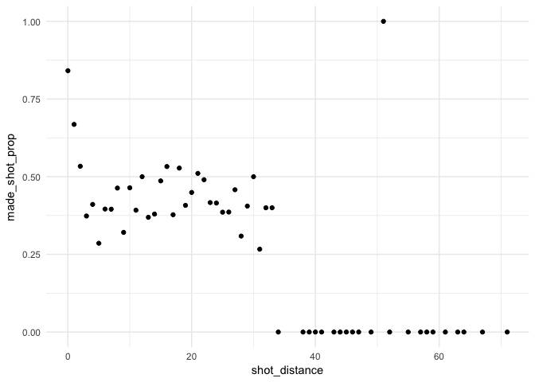
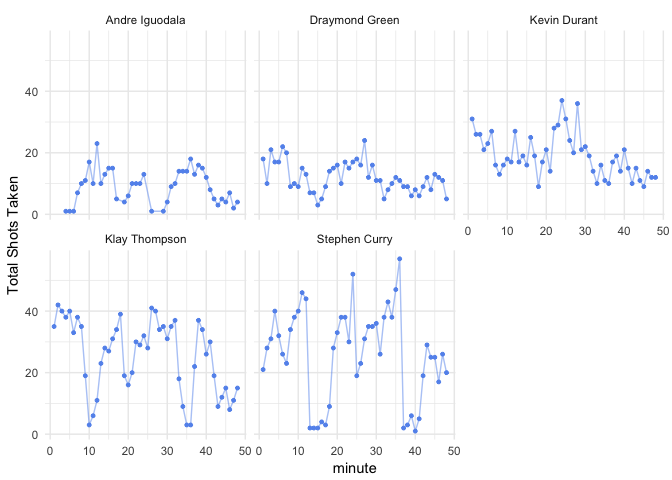

hw02-soham-ghosh
================
Soham Ghosh

### 5.1 Total Shots by Player

``` r
data <- read.csv("../data/shots-data.csv", stringsAsFactors = FALSE)
library(dplyr)
```

    ## 
    ## Attaching package: 'dplyr'

    ## The following objects are masked from 'package:stats':
    ## 
    ##     filter, lag

    ## The following objects are masked from 'package:base':
    ## 
    ##     intersect, setdiff, setequal, union

``` r
arrange(count(data, data$name), desc(n))
```

    ## # A tibble: 5 x 2
    ##   `data$name`        n
    ##   <chr>          <int>
    ## 1 Stephen Curry   1250
    ## 2 Klay Thompson   1220
    ## 3 Kevin Durant     915
    ## 4 Draymond Green   578
    ## 5 Andre Iguodala   371

``` r
#combined_ordered <- select(arrange(summarise(group_by(dat, name), points = nrow(shot_type)), desc(points)), name, points)
#combined_ordered
```

### 5.2 Effective Shooting Percentage

#### 2 Point Percentage

``` r
data %>% group_by(name) %>% filter(shot_type == "2PT Field Goal") %>% summarise(total = length(shot_type), made = length(shot_made_flag[shot_made_flag == "made_shot"]), perc_made = made / total) %>% arrange(desc(perc_made))
```

    ## # A tibble: 5 x 4
    ##   name           total  made perc_made
    ##   <chr>          <int> <int>     <dbl>
    ## 1 Andre Iguodala   210   134     0.638
    ## 2 Kevin Durant     643   390     0.607
    ## 3 Stephen Curry    563   304     0.540
    ## 4 Klay Thompson    640   329     0.514
    ## 5 Draymond Green   346   171     0.494

#### 3 Point Percentage

``` r
data %>% group_by(name) %>% filter(shot_type == "3PT Field Goal") %>% summarise(total = length(shot_type), made = length(shot_made_flag[shot_made_flag == "made_shot"]), perc_made = made / total) %>% arrange(desc(perc_made))
```

    ## # A tibble: 5 x 4
    ##   name           total  made perc_made
    ##   <chr>          <int> <int>     <dbl>
    ## 1 Klay Thompson    580   246     0.424
    ## 2 Stephen Curry    687   280     0.408
    ## 3 Kevin Durant     272   105     0.386
    ## 4 Andre Iguodala   161    58     0.360
    ## 5 Draymond Green   232    74     0.319

#### Total Points Percentage

``` r
data %>% group_by(name) %>% summarise(total = length(shot_made_flag), made = length(shot_made_flag[shot_made_flag == "made_shot"]), perc_made = made / total) %>% arrange(desc(perc_made))
```

    ## # A tibble: 5 x 4
    ##   name           total  made perc_made
    ##   <chr>          <int> <int>     <dbl>
    ## 1 Kevin Durant     915   495     0.541
    ## 2 Andre Iguodala   371   192     0.518
    ## 3 Klay Thompson   1220   575     0.471
    ## 4 Stephen Curry   1250   584     0.467
    ## 5 Draymond Green   578   245     0.424

### 6.1 Shooting Distance - dplyr table

``` r
distance_percentage <- data %>% group_by(shot_distance) %>% summarise(total = length(shot_made_flag), made = length(shot_made_flag[shot_made_flag == "made_shot"]), made_shot_prop = made / total) %>% select(shot_distance, made_shot_prop) %>% arrange(shot_distance)
distance_percentage
```

    ## # A tibble: 56 x 2
    ##    shot_distance made_shot_prop
    ##            <int>          <dbl>
    ##  1             0          0.841
    ##  2             1          0.668
    ##  3             2          0.534
    ##  4             3          0.373
    ##  5             4          0.411
    ##  6             5          0.286
    ##  7             6          0.396
    ##  8             7          0.395
    ##  9             8          0.463
    ## 10             9          0.321
    ## # ... with 46 more rows

### 6.2 ggplot

``` r
library(ggplot2)
ggplot(data = distance_percentage, aes(x = shot_distance, y = made_shot_prop)) +geom_point() + theme_minimal()
```

 I observe a graph that shows a trend in that as the distance from the shot to the hoop increases, the chances that the shot itself makes decreases. There is a steep decrease from 0 to 5 feet. From there, I see a slight increase from 5 to 20 feet. From 20 feet onwards, there is a decrease in the field goal percentage. Other than 5 to 20 feet, the shorter the distance, the more effective the shot. Inside the 5-20 feet range, the opposite seems to be the case. From about 35 feet onwards, the chance of making a shot is basically null. 0-4, 12,16, 18, 21, and 30 feet shots have a 50% chance of making it or higher.

### 7. Total Number of Shots by Minutes of Occurence

``` r
shots_by_minute = summarise(group_by(data, minute, name), total = length(shot_type))
ggplot(data = shots_by_minute, aes(x = minute, y = total)) + 
  geom_point(size = 1, color = "cornflowerblue") +
  geom_path(alpha = 0.5, color = "cornflowerblue") +
  facet_wrap(~ name) +
  theme_minimal() +
  scale_x_continuous() +
  ylab("Total Shots Taken") 
```

 The 5 graphs show how many number of shots they have taken in total, specifically for each certain point of time (minutes into the game). There are a total of 48 minutes in each game.
