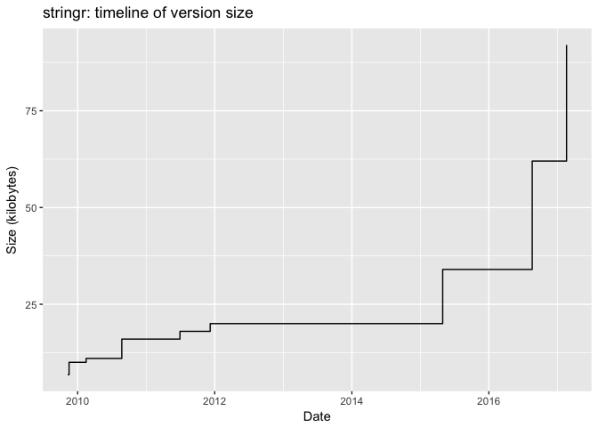
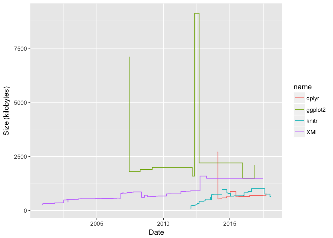
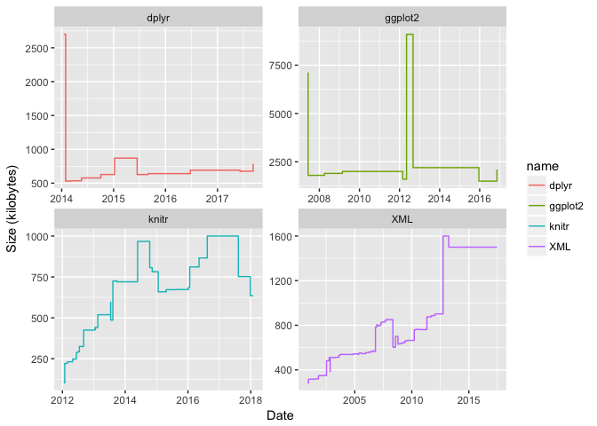
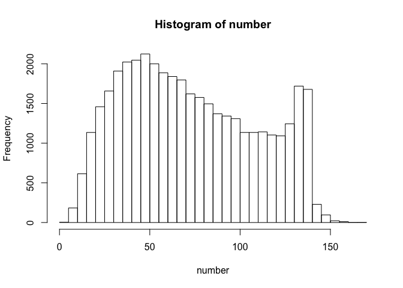
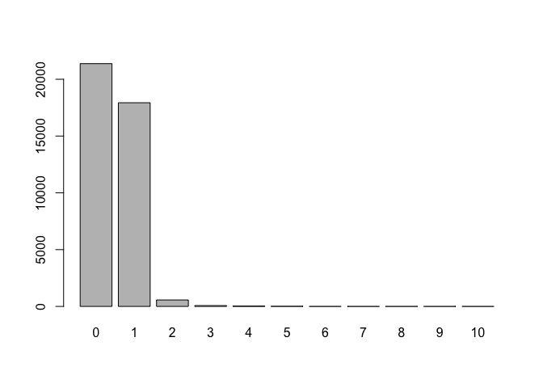
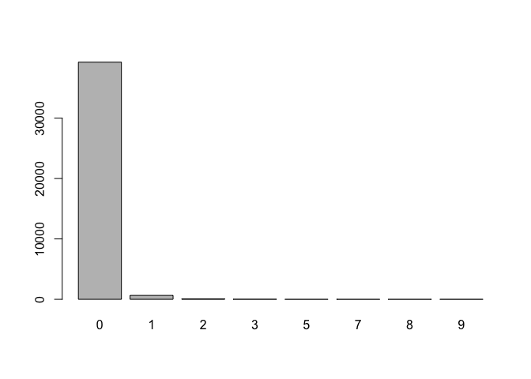

hw04-soham-ghosh
================

HW 04
=====

### 1.4) Archive of "stringr"

``` r
library(ggplot2)
source("../code/archive-functions.R")
raw_data <- read_archive('stringr')
clean_data <- clean_archive(raw_data)
plot_archive(clean_data)
```



### 1.5) Archives of "splyr", "ggplot2", "XML", and "knitr"

``` r
rd_ggplot <- read_archive('ggplot2')
cd_ggplot <- clean_archive(rd_ggplot)
write.csv(cd_ggplot, "../data/ggplot2-archive.csv")
rd_xml <- read_archive('XML')
cd_xml <- clean_archive(rd_xml)
write.csv(cd_xml, "../data/xml-archive.csv")
rd_knitr <- read_archive('knitr')
cd_knitr <- clean_archive(rd_knitr)
write.csv(cd_knitr, "../data/knitr-archive.csv")
rd_dplyr <- read_archive('dplyr')
cd_dplyr <- clean_archive(rd_dplyr)
write.csv(cd_dplyr, "../data/dplyr-archive.csv")
rd_stringr <- read_archive('stringr')
cd_stringr <- clean_archive(rd_stringr)
write.csv(cd_stringr, "../data/stringr-archive.csv")

big_plot <- rbind(cd_dplyr, cd_ggplot, cd_knitr, cd_xml)
ggplot(big_plot, aes(x = date, y = size, color = name)) +
  labs(y = 'Size (kilobytes)', x = 'Date') +
  geom_step()
```



``` r
ggplot(big_plot, aes(x = date, y = size, color = name)) +
  geom_step() + 
  labs(y = 'Size (kilobytes)', x = 'Date') + 
  facet_wrap(~ name, scales = 'free')
```



2) Regex Functions
------------------

``` r
source("../code/regex-functions.R")
split_chars('Go Bears!')
```

    ## [1] "G" "o" " " "B" "e" "a" "r" "s" "!"

Data "Emotion" in Text
----------------------

``` r
content = read.csv("../data/text-emotion.csv", stringsAsFactors = FALSE)$content
```

### 3.1) Number of characters per tweet

``` r
number = nchar(content)
print(summary(number))
```

    ##    Min. 1st Qu.  Median    Mean 3rd Qu.    Max. 
    ##    1.00   43.00   69.00   73.41  103.00  167.00

``` r
hist(number, breaks = seq(0, max(number)+5, by = 5))
```



### 3.2) Number of Mentions

``` r
mentions = 1:length(content)
for (i in mentions) {
  mentions[i] = sum(grepl("^@[A-Za-z0-9_]{1,15}", str_split(content[i], " ")[[1]]))
}
mentions = unlist(mentions)
mention_count = table(mentions)
barplot(mention_count)
```



``` r
mention_count
```

    ## mentions
    ##     0     1     2     3     4     5     6     7     8     9    10 
    ## 21085 18138   635    83    35    14     5     1     2     1     1

``` r
content[mentions == 10]
```

    ## [1] "last #ff  @Mel_Diesel @vja4041 @DemonFactory @shawnmcguirt @SEO_Web_Design @ChuckSwanson @agracing @confidentgolf @tluckow @legalblonde31"

### 3.3) Hashtags

``` r
hashtags = 1:length(content)
hashtag_length = rep(0,max(number))

for (i in hashtags) {
  tweets = str_split(content[i], " ")[[1]]
  tags = grepl("^#[A-Za-z][A-Za-z0-9]*", tweets)
  hashtags[i] = sum(tags)
  for (j in 1:length(tags)) {
    if (tags[j]) {
      index <- nchar(tweets[j])
      hashtag_length[index] = hashtag_length[index] + 1
    }
  }
}

names(hashtag_length) <- 1:length(hashtag_length)
hashtag_length <- hashtag_length[hashtag_length > 0]
hashtags = unlist(hashtags)
hashtag_counts = table(hashtags)

hashtag_counts
```

    ## hashtags
    ##     0     1     2     3     5     7     8     9 
    ## 39265   647    65    17     1     1     1     3

``` r
barplot(hashtag_counts)
```



``` r
sum(hashtag_length*as.numeric(names(hashtag_length))/sum(hashtag_length))
```

    ## [1] 8.997714

``` r
names(hashtag_length[hashtag_length == max(hashtag_length)])
```

    ## [1] "5"

Average length of hashtags: 8.9977 Most common length of hashtags: 5
